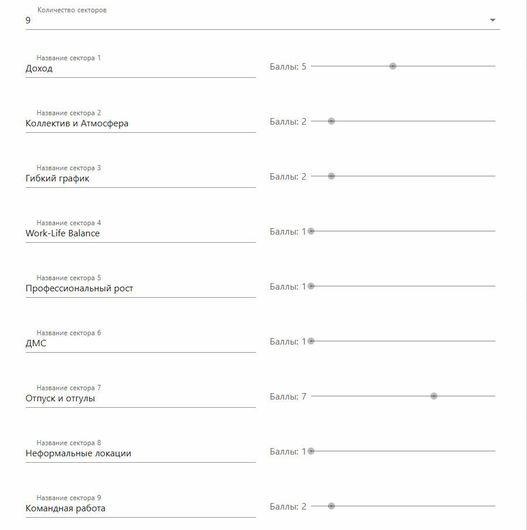
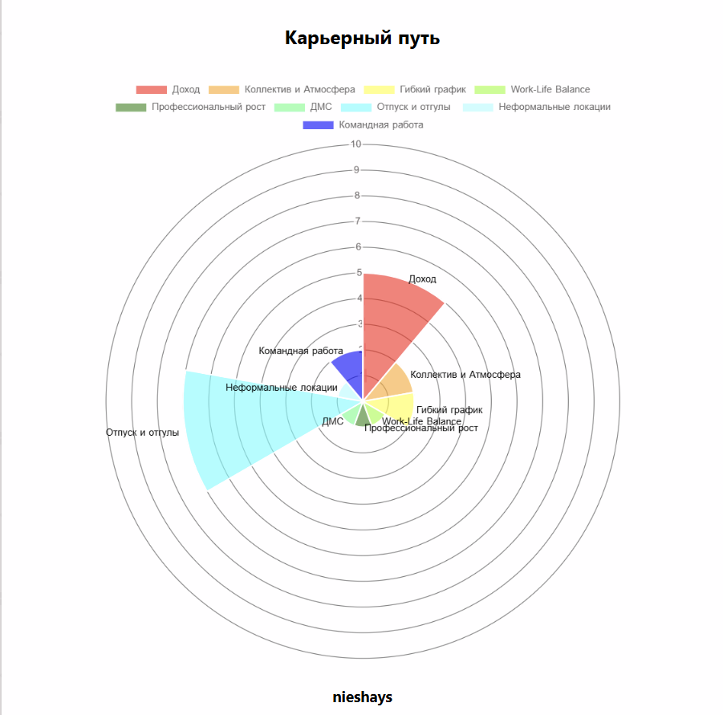
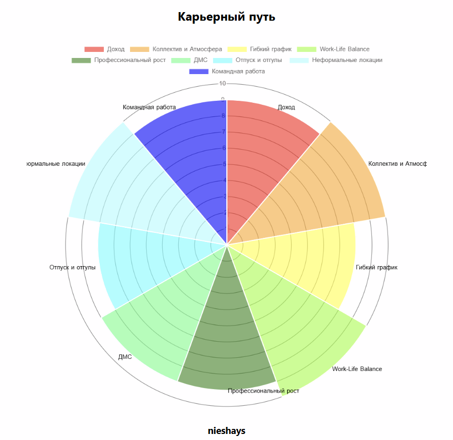
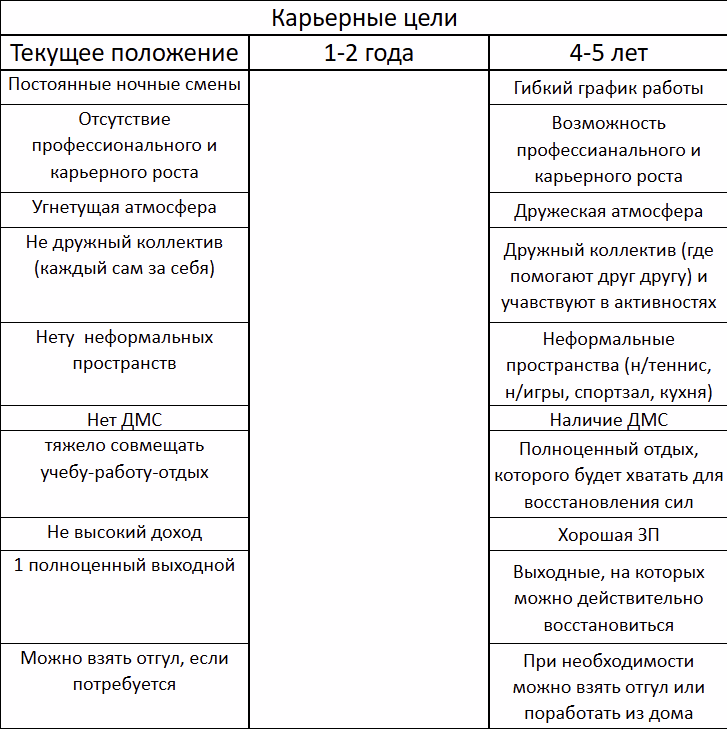

# Career track. Project 00

## Задача 

Для решения этой задачи необходимо составить твой карьерный трек на ближайшие 3-5 лет. Для этого необходимо понять карьерные цели, ценности и составить пошаговый план реализации.  

## Exercise 00 
### Колесо карьерного баланса

1. Выпиши критерии выбора работы и оцени по шкале от 1 до 10, что происходит на данный момент (от 5 и более). 

- Для меня важными критериями при выборе работы являются: 
    1) Доход
    2) Коллектив и Атмосфера
    3) Командная работа
    4) Гибкий график и локация
    5) Work-Life Balance
    6) Профессиональный рост
    7) Здоровье (ДМС)
    8) Отпуск и отгулы
    9) Неформальные локации

- Колесо карьерного баланса на данный момент:

2. Сделай второе колесо с теми же критериями и оцени их снова от 1 до 10, как бы тебе хотелось, чтобы эти критерии выглядели в будущем.

- Колесо карьерного баланса в будущем:

3. Для каждого критерия придумай и впиши шаги действия, которые ты будешь делать, чтобы его достичь.

    1) Доход - для выполнения этого критерия нужно получить ценные знания, которые будут достойно оценивать (научиться тому, что востребованно на рынке труда).
    2) Коллектив и Атмосфера - знакомиться, общаться, предлагать интересные мероприятия
    3) Командная работа - помогать в решинии трудной задачи, а если трудно самому, то просить коллег о помощи. Выполнять работу дружно с коллективом
    4) Гибкий график и локация - Работать не только в одном графике, но имея возможность чередовать. Уточнять у руководителя можно ли работать в определенной локации
    5) Work-Life Balance - для этого критерия нужно будет грамотно распределить своё время. Работа строго в одно время, а личная жизнь в остальное.
    6) Профессиональный рост - возможность учиться у более опытных коллег, получение новых знаний и навыков с возможностью их реализации 
    7) Здоровье (ДМС) - найти работодателя, у которого можно получать ДМС с широким перечнем услуг
    8) Отпуск и отгулы - в случае необходимости можно было бы взять несколько дней отгула по семейным обстоятельствам, но для этого нужно очень хорошо трудиться
    9) Неформальные локации - приглашать коллег на чашечку кофе, поиграть в настольный теннис, позаниматься в тренажерном зале или поиграть в настольные игры

Рекомендуем выполнять данное задание с помощью HOLST или подобного инструмента. Прикрепи визуализацию итогового колеса (2 шт.) в папку src.    

## Exercise 01
### Карьерные цели

1. Сделай таблицу твоей карьерной цели на 1-2 года и 4-5 лет.   
2. В первой графе опиши текущее состояние карьеры.  
3. В третьей графе на основе ценностей и колеса карьерного баланса напиши, к каким карьерным целям через 5 лет ты стремишься, что для тебя важно в работе.
4. Вторую графу пока оставь пустой.  

