## Part 1. Установка ОС

**== Задание ==**

#### Установите Ubuntu 20.04 Server LTS без графического интерфейса. (Используем программу для виртуализации — VirtualBox)
- Графический интерфейс должен отсутствовать.

- Узнай версию Ubuntu, выполнив команду
**cat /etc/issue**

- Вставь скриншот с выводом команды:

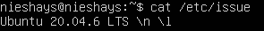

## Part 2. Создание пользователя

**== Задание ==**

#### Создайте пользователя, отличного от созданного при установке. Пользователь должен быть добавлен в группу adm.
- Вставь скриншот вызова команды для создания пользователя:

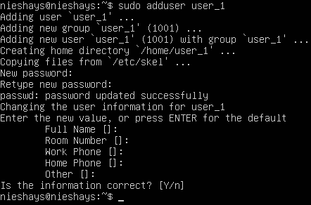

- Добавление в группу adm:

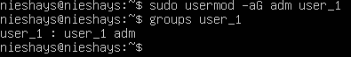

- Новый пользователь должен быть в выводе команды
**cat /etc/passwd**
- Вставь скриншот с выводом команды.

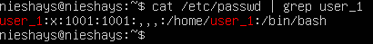

**Полный вывод:**

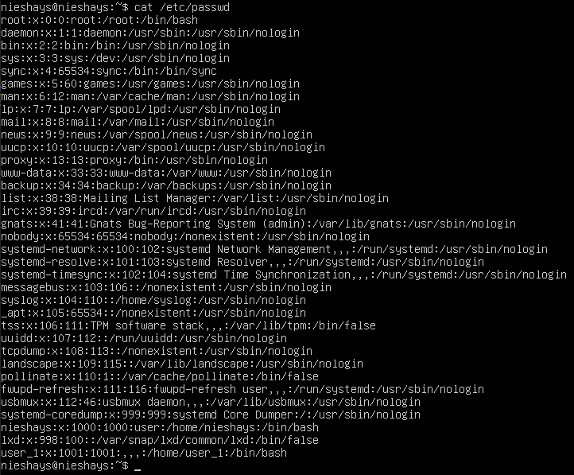

## Part 3. Настройка сети ОС

- 3.1 Задай название машины вида user-1.

Название машины задается при помощи команды:
**sudo hostnamectl set-hostname user-1**

Вывод команды после ввода пароля администратора:

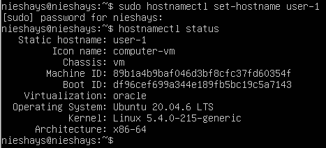

- 3.2 Установил временную зону, соответствующую моему текущему местоположению, а именно **"Europe/Moscow"**

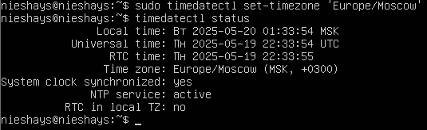

- 3.3 Выведи названия сетевых интерфейсов с помощью консольной команды.

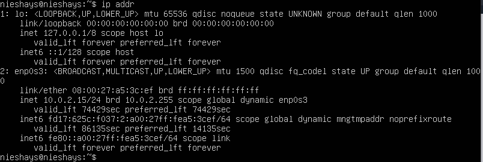

**Интерфейс lo (петлевой)** — это как внутренний провод внутри компьютера, позволяющий программам общаться друг с другом без использования настоящей сети. Он нужен для:
1. Локальной связи: программы могут отправлять и получать данные внутри компьютера.
2. Тестирования сети: проверка работоспособности сетевых компонентов компьютера.
3. Работы служб: многие программы (например, веб-сервер) используют его для локального доступа.

- 3.4 Используя консольную команду, получите IP-адрес устройства, на котором вы работаете, от DHCP-сервера.

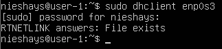

Таким образом после ввода команды **sudo dhclient enp0s3** устройство получает уникальный ip-адрес, но на экран он не выводится.

**Расшифровка DHCP**:
DHCP означает Dynamic Host Configuration Protocol (Протокол динамической конфигурации хоста). Это протокол сети TCP/IP, позволяющий автоматическое назначение IP-адресов устройствам в локальной сети. Сервер DHCP назначает каждому устройству уникальный IP-адрес, маску подсети, шлюз по умолчанию и другие необходимые настройки сети. Таким образом, пользователям не нужно вручную настраивать сетевые параметры устройств каждый раз при подключении к новой сети.

- 3.5 Определите и выведите на экран внешний IP-адрес шлюза (ip) и внутренний IP-адрес шлюза, он же IP-адрес по умолчанию (gw).

При помощи команды **route -n** можно узнать внешний ip-адрес шлюза, который виден извне моей сети
А при помощи команды **curl ifconfig.me** узнаю внутренний ip-адрес шлюза. Как правило это роутер, к которому мое устройство подключается по локальной сети

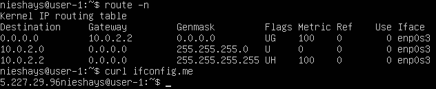

- 3.6 Задайте статичные (заданные вручную, а не полученные от DHCP-сервера) настройки ip, gw, dns (используйте общедоступные DNS-серверы, например 1.1.1.1 или 8.8.8.8).

Через команду **sudo nano /etc/netplan/*.yaml** установил все необходимые параметры и статические ip-aдреса:

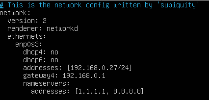

- 3.7 Перезагрузи виртуальную машину. Убедитесь, что статические сетевые настройки (ip, gw, dns) соответствуют заданным в предыдущем пункте.

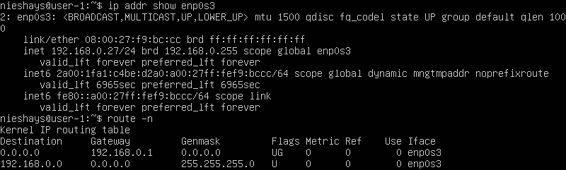

- 3.8 Успешно пропингуй удалённые хосты 1.1.1.1 и ya.ru (и хост 8.8.8.8 тоже) и вставь в отчёт скриншот с выводом команды. В выводе команды должна быть фраза «0% потери пакетов».

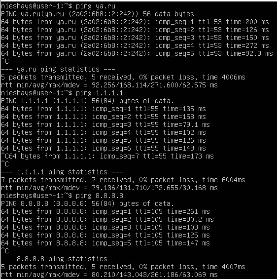

## Part 4. Обновление ОС

**== Задание ==**

- Обновите системные пакеты до последней версии на момент выполнения задания.
- После обновления системных пакетов при повторном вводе команды обновления должно появиться сообщение об отсутствии обновлений.
- Вставьте скриншот с этим сообщением в отчёт.

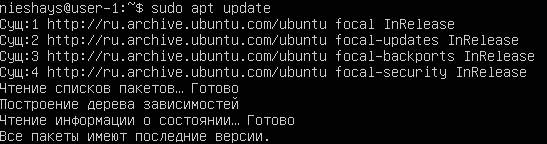

## Часть 5. Использование команды sudo

- 5.1 Командой **sudo usermod -aG sudo user-1** мы добаляем позьзователя созданного в части 2 группу sudo и наделяем его правами администратора.
После перезагрузки системы (чтобы внесенные изменения вступили в силу), командой **su - user-1**, мы открываем терминал от имени user-1/
Чтобы проверить успешно ли сохранились изменения попробуем проверить свежие обновления выполнив команду **sudo apt update**, и работает ли sudo у user-1

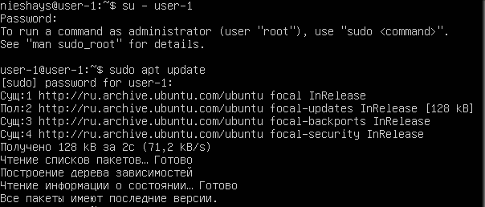

**sudo** нужна, чтобы запускать команды с правами администратора (root), не входя в систему как root. Это безопаснее, позволяет контролировать, кто что делает в системе, и вести учёт.

- 5.2 При помощи команды **sudo hostnamectl set-hostname vbuser-1** задаем имя хост машины **vbuser-1**.
После перезагрузки переключаемся на user-1 и видим измененное название хост-машины

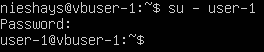

## Часть 6. Установка и настройка службы времени

**== Задание ==**

- Настрой службу автоматической синхронизации времени.
- Выведи время часового пояса, в котором ты сейчас находишься.

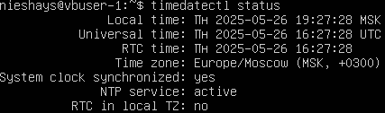

- Вывод следующей команды должен содержать NTPSynchronized=yes:
**timedatectl show**

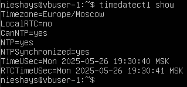

- Вставьте скриншоты с правильным временем и выводом команды в отчёт.

## Часть 7. Установка и использование текстовых редакторов

- 7.1 Установите текстовые редакторы VIM (+ любые два по желанию NANO, MCEDIT, JOE и т. д.)
- 7.2 Используя каждый из трёх выбранных редакторов, создайте файл **test_X.txt**, где **X** — название редактора, в котором создан файл. Напишите в нём свой никнейм, закройте файл и сохраните изменения.

Для создания файла в редакторе **nano**, вводится команда **sudo nano test_nano.txt**. Затем вводятся изменения в новый файл. Чтобы сохранит изменения можно нажать комбинацию клавиш **ctrl+x**, появится надпись внизу **"хотите сохранить изменения?"**. Нажать клавишу **Y**  и изменения сохранятся

Для создания файла в редакторе **vim**, вводится команда **sudo vim test_nano.txt**. Для редактирования созданного файла вводим команду **vim test_nano.txt** (если файл уже создан), затем клавишу **a** для редактирования файла. Чтобы сохранить изменения и выйти нажимаем клавишу **esc**, после вводим команду для выхода из редактора **:wq** (:wq! - принудительная, если возникнет ошибка).

Для создания файла в редакторе **mc** (MCEDIT), вводится команда **touch test_mc.txt**. Введя команду **мс** нас перебросит в сам редактор, из которого уже можно редактировать наш файл. Сначала нужно выбрать наш файл в директории и нажать клавишу **f4** для редактирования. А для сохранения можно нажать **enter**, а затем **ctrl+k+q** редактор спросит хотим ли мы сохранить изменения **y - да**, **n - нет**. После нажатия клавишы **y** файл сохраниться и закроется. Чтобы выйти из редактора мс нужно нажать клавишу **f10**.

- 7.3 Используя каждый из трёх выбранных редакторов, открой файл для редактирования, отредактируй файл, заменив никнейм на строку «21 School 21», закрой файл без сохранения изменений.

7.3.1 Для редактирования файла мс нужно ввести в командной строке команду **мс**. В редакторе выбираем файл **test_mc.txt**, нажимаем клавишу **f4** и после открывается наш txt файл в котором сразу же можно поменять нашу надпись на **21 School 21**. Нажав комбинацию клавиш **ctrl+k+q** редактор спросит хотим ли мы сохранить изменения y - да, n - нет. Выбираем **n**(нет) и наши изменения не сохраняются. Чтобы выйти из редактора мс нужно нажать клавишу **f10**.

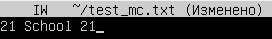

7.3.2 Для редактирования файла в редакторе nano, вводится команда **sudo nano test_nano.txt**. Затем вводятся изменения в новый файл. Для выхода можно нажать комбинацию клавиш **ctrl+x**, появится надпись внизу **"хотите сохранить изменения?"**. Нажать клавишу **N** и изменения сохранятся не будут

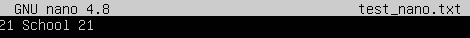

7.3.3 Для редактирования файла вводим команду **vim test_nano.txt**, затем клавишу **a** для редактирования файла. Меняем текст на **21 School 21**.
Чтобы выйти и не сохранять изменения нажимаем клавишу **esc**, после вводим команду для выхода из редактора **:q!**(принудетельный выход без сохранения изменений).

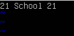

- 7.4 Используя каждый из трёх выбранных редакторов, отредактируй файл ещё раз (по аналогии с предыдущим пунктом), а затем освои функции поиска по содержимому файла (слово) и замены слова на любое другое.

7.4.1 Поиск нужного слова в файле через редактор **vim** осуществляется при помощи наклонной черты **/** (например: /желаемое слово). А изменения слова через команду **:s/старое слово/новое слово**. Для выхода и сохранения изменений **:qw** 

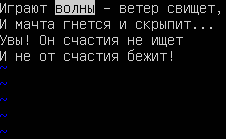   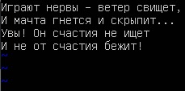

7.4.2 Поиск нужного слова в файле через редактор nano осуществляется при помощи комбинации клавиш **ctrl+w**. А замена слова осуществляется при помощи **ctrl+\\**. Сначала вводится старое слово, нажимается **Enter** затем новое слово и снова **Enter**. Для выхода нажимаем **ctrl+x** и **Y** для сохранения изменений.

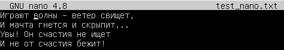  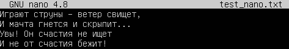

7.4.3 Для редактирования файла мс нужно ввести в командной строке команду **мс**. В редакторе выбираем файл **test_mc.txt**, нажимаем клавишу **f4** и после открывается наш txt файл. Для поиска слова нужно нажать **ctrl+s**. А вот для замены нужно выйти из текстового файла **ctrl+k+q**, выбрать нужный файл и ввести команду **sed -i 's/старое слово/новое слово/g' test_mc.txt** и нажать **Enter**. Зайдя снова в наш файл можно увидеть что выбранное нами слово поменялось на то, которое мы захотели.

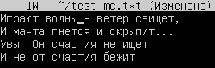    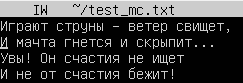

## Часть 8. Установка и базовая настройка сервиса SSHD

**== Задание ==**

- Установи службу SSHd.

- Добавь автозапуск службы при загрузке системы.
**sudo systemd enable ssh.service**

- Настройте службу SSHd на порт 2022.

- Используя команду **ps**, проверьте наличие процесса **sshd**. Для этого к команде нужно подобрать ключи.

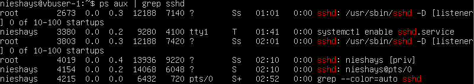

1. ps aux: Выводит список всех процессов, работающих в системе.
2. a: Отображает процессы всех пользователей.
3. u: Добавляет информацию о пользователе (владельце процесса).
4. x: Отображает процессы, не связанные с терминалом.
5. grep sshd: Фильтрует вывод ps aux, показывая только строки, содержащие “sshd”.

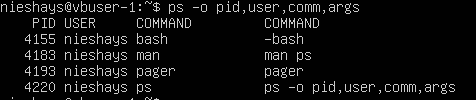

1. ps: Выводит список всех процессов, работающих в системе.
2. -o (или --format): этот параметр указывает команде ps, что вы хотите настроить формат вывода. Он сообщает ps, что вместо стандартного набора столбцов вы хотите указать свой собственный набор столбцов (полей).
3. pid: Отображает идентификатор процесса.
4. user: Отображает имя пользователя.
5. comm: Отображает только имя исполняемого файла (команды), связанного с процессом. 
6. args: Отображает полную командную строку (аргументы команды), использованную для запуска процесса. 

- Перезагрузи систему.

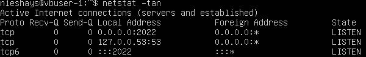

**netstat**: Это сама команда Network Statistics, которая отображает статистику сетевых подключений, таблиц маршрутизации, статистику интерфейсов и т.д.

- **-t**: Этот ключ указывает netstat отображать только TCP-соединения. TCP (протокол управления передачей) — один из основных протоколов Интернета, используемый для надёжной передачи данных между приложениями.
- **-a**: Этот ключ указывает netstat отображать все соединения, включая прослушивающие порты (listening ports), то есть порты, на которых сервер ожидает входящие соединения. Без -a будут показаны только установленные соединения.
- **-n**: Этот ключ указывает netstat отображать IP-адреса и номера портов в числовом виде, а не пытаться преобразовать их в имена хостов и сервисов. Это ускоряет вывод и предотвращает проблемы с DNS-серверами.

- **Proto**: Протокол, используемый соединением (в нашем случае всегда tcp, так как мы использовали ключ -t).
- **Recv-Q**: количество байт, полученных, но еще не прочитанных процессом. Если это значение не равно нулю, это может указывать на проблему с приложением, которое не успевает обрабатывать входящие данные.
- **Send-Q**: количество байт, ожидающих отправки. Если это значение не равно нулю, это может указывать на проблему с приложением, которое не успевает отправлять данные, или на перегрузку сети.
- **Local Address**: Локальный IP-адрес и номер порта, используемые на вашей машине. Формат: IP-адрес:номер_порта.
- **Foreign Address**: IP-адрес и номер порта удалённой машины, с которой установлено соединение. Формат: IP-адрес:номер_порта.
- **State**: Состояние соединения. Наиболее распространенные состояния:
1. **LISTEN**: Процесс ожидает входящих соединений на указанном порту.
2. **ESTABLISHED**: Соединение установлено и активно передает данные.
3. **SYN_SENT**: Клиент пытается установить соединение.
4. **SYN_RECV**: Сервер получил запрос на соединение.
5. **FIN_WAIT1**, **FIN_WAIT2**: Соединение закрывается.
6. **TIME_WAIT**: Cоединение было закрыто, но остается в таком состоянии еще некоторое время, чтобы гарантировать доставку всех пакетов.
7. **CLOSE_WAIT**: Сервер получил запрос на закрытие соединения, но еще не закрыл его со своей стороны.
8. **CLOSED**: Соединение закрыто.

В столбце Local Address **0.0.0.0** означает, что процесс прослушивает все доступные IP-адреса на вашем компьютере. Это означает, что он будет принимать соединения, поступающие на любой из IP-адресов, назначенных вашему компьютеру.

 Foreign Address  **0.0.0.0:\*** это значит, что прослушивающий порт ожидает любое входящее соединение с любого IP-адреса

## Часть 9. Установка и использование утилит top, htop

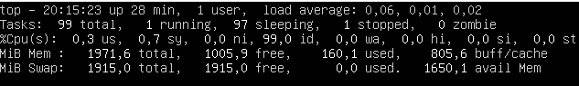 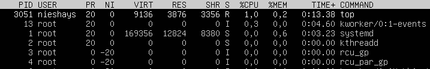

- По результатам выполнения команды top определите и укажите в отчёте:

    1. Время безотказной работы: **up 28 min** (без перезагрузки)
    
    2. Количество авторизованных пользователей: **1 user** (сколько пользователей на данный момент вошли в систему)
    
    3. Среднюю загрузку системы: **0,06**, **0,01**, **0,02** (низкие значения (близкие к 0) указывают на низкую загрузку, значения, близкие к количеству процессоров, указывают на высокую загрузку.)
    
    4. Общее количество процессов: **99 total** (показывает общее количество процессов, запущенных в системе.)
    
    5. Загрузку cpu: 
        - **0,3 us** (процент времени, затраченного ЦП на пользовательские процессы); 
        - **0,7 sy** (процент времени, затраченного ЦП на системные процессы (ядро)); 
        - **99,0 id** (процент времени CPU, находящегося в режиме простоя (idle)).
    
    6. Загрузку памяти:
        - **1971,6 total**: Общий объем физической памяти (RAM) в системе (в MiB).
        - **1005,9 free**: Объем свободной физической памяти (в MiB).
        - **160,1 used**: Объем используемой физической памяти (в MiB).
        - **805,6 buff/cache**: Объем памяти, используемый для буферов и кэша (в MiB).
        - **1915,0 total**: Общий объем SWAP-пространства (в MiB).
        - **1915,0 free**: Объем свободного пространства SWAP (в MiB).
        - **0.0 used**: Объем используемого пространства SWAP (в MiB).

    7. Рid процесса, занимающего больше всего памяти: **1** (0,6 %MEM) 
    8. Pid процесса, занимающего больше всего процессорного времени: **3051** (1.0 %CPU)

- В отчёт вставь скриншот с выводом команды htop:
отсортированному по PID, PERCENT_CPU, PERCENT_MEM, TIME;
Фильтрация осущетвляется через кнопку **f6** 

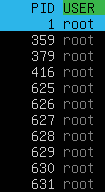

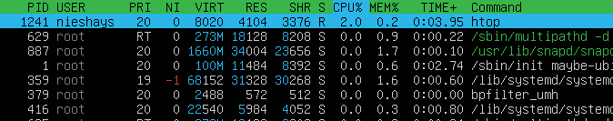

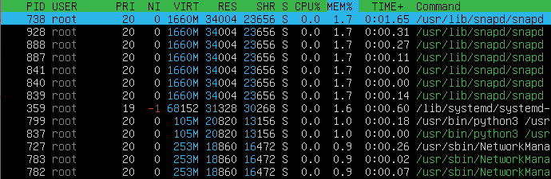

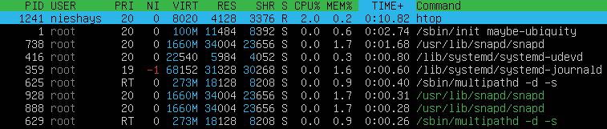

Oтфильтрованному для процесса sshd (нажать **f4**, ввести **sshd**, **enter**);

с процессом **syslog**, найденным с помощью поиска;
Через **f3**, ввести **syslog** нажать **enter**. 

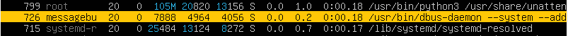

с добавлением вывода имени **hostname**, **clock** и **uptime**.

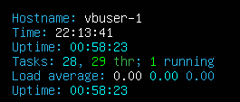

## Part 10. Использование утилиты **fdisk**

- Запустите команду fdisk -l.

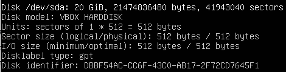

- В отчёте укажите название жёсткого диска, его размер и количество секторов, а также размер swap-памяти.

    - Название жеского диска: /dev/sda
    - Модель диска: жесткий диск 
    - Размер: 20Гиб (21474836480 байт)
    - Кол-во секторов: 41943040
    - Размер swap-памяти: 1,9Гб
    
Размер свап-памяти можно узнать введя команду **free -h**

## Part 11. Использование утилиты **df**

- 11.1 В отчёте укажите для корневого раздела (/):

    - размер раздела,
    - размер занятого пространства,
    - размер свободного пространства,
    - процент использования.

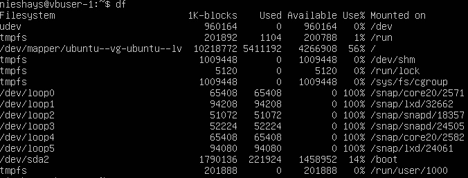

- Размер раздела: 10218772Киб (9,74Гб)
- Размер занятого пространства: 5411192Киб (5,16Гб)
- Размер свободного пространства: 4266908Киб (4,07Гб)
- Процент использования: 56%

- 11.2 В отчёте укажите для корневого раздела (/):

    - размер раздела,
    - размер занятого пространства,
    - размер свободного пространства,
    - процент использования.

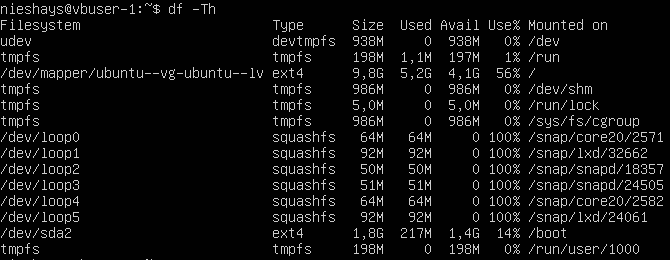

- Размер раздела(Size): 9,8Гб
- Размер занятого пространства(Used): 5,2Гб
- Размер свободного пространства(Avail): 4,1Гб
- Процент использованния(Use%): 56%

## Part 12. Использование утилиты **du**

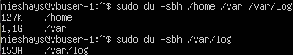

Здесь используется ключ: **-sbh** для более короткого и понятного вывода:

- **-s**: отображает только общую сумму для выбранных аргументов
- **-b**: отображает размер в байтах
- **-h**: отображает размеры в удобочитаемом формате

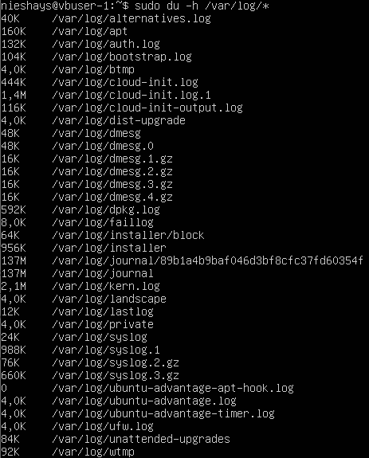

Здесь введя команду **du -h /var/log/\*** означает, что утилиту **du** нужно применить ко всем каталогам, находящимся непосредственно в **/var/log**. А звездочка в конце команды означает символ подстановки, который заменяется списком всех элементов в указанном каатлоге.

## Part 13. Установка и использование утичиты **ncdu**

**== Задание ==**

- Установи утилиту ncdu.
Утилита **ncdu** устанавливается при помощи команды **sudo apt install ncdu**

- Выведи размер папок **/home**, **/var**, **/var/log**.
Чтобы вывести размеры этих папок, нужно по отдельности ввести команды: 
1. **ncdu /home**
2. **ncdu /var**
3. **ncdu /var/log**

- Размеры должны примерно соответствовать полученным в части 12.

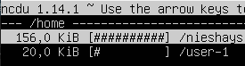 

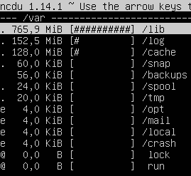

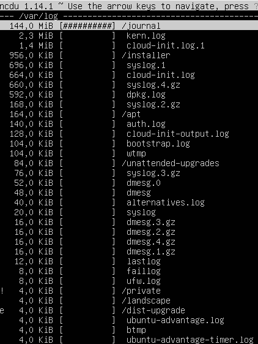

## Part 14. Работа с системными журналами

**== Задание ==**

- Открой для просмотра:
1. **/var/log/dmesg**
2. **/var/log/syslog**
3. **/var/log/auth.log**

Для просмотра этих файлов можно воспользоваться **cat**. Это самый простой способ и он выведет полный список, что может быть не всегда удобно.

Можно воспользоваться **less**. Позволет свотреть файл постранично используя кнопки **верх** и **вниз**, **q** для выхода

**head** - Показывает только первые несколько строк файла (по-умолчанию 10)

**tail** - Показывает только последние несколько строк файла (по-умолчанию 10). Очень удобно для просмотра последних событий в файле

- Напиши в отчёте время последней успешной авторизации, имя пользователя и метод входа в систему.

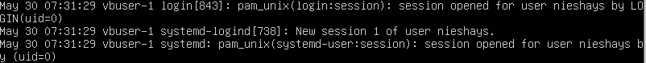

    Время последней успешной авторизации: 30 мая 07:31:29
    Имя пользователя: nieshays
    Способ входа: консольный вход (login)

- Перезапусти службу SSHd.
- Вставь в отчёт скрин с сообщением о рестарте службы (искать в логах).

Чтобы найти сообщение о перезагрузке службы SSHd, нужно ввести команду **tail /var/log/syslog**

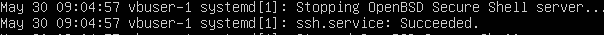

Сообщение **ssh.service: Succeeded** говорит о том, что служба перезагружена успешно. 

## Part 15. Использование планировщика заданий CRON

**== Задание ==**

- Используя планировщик заданий, запусти команду uptime через каждые 2 минуты.

Чтобы запустить планировщик заданий в командной строке нужно ввести **crontab -e**. В открывшимся файле добавить строку ***/2 * * * * uptime >> /tmp/uptime/.log 2>&1**

1. ***/2**: Запускает каждую вторую минуту.
2. *: Каждый час.
3. *: Каждый день.
4. *: Каждый месяц.
5. *: Каждый день недели.
6. **uptime**: Команда, которую нужно выполнить.
7. **>> /tmp/uptime.log**: Перенаправляет вывод команды uptime в файл **/tmp/uptime.log**. **">>"** означает «добавить к файлу» (если файл существует, вывод будет добавлен в конец, а не перезаписан).
8. **2>&1**: Перенаправляет стандартный поток ошибок (2) в стандартный поток вывода (1). Это необходимо для того, чтобы сообщения об ошибках также записывались в файл журнала.

- Найди в системных журналах строчки (минимум две в заданном временном диапазоне) о выполнении.

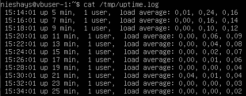

- Выведи на экран список текущих заданий для CRON.

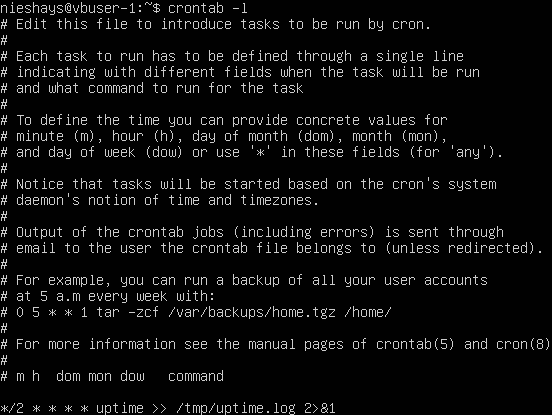

- Вставь в отчёт скрины со строчками о выполнении и списком текущих задач.

- Удали все задания из планировщика заданий.
- В отчёт вставь скрин со списком текущих заданий для CRON.

Для удаления всех заданий **CRON** нужно ввести команду **crontab -r**.
Для проверки введем **crontab -l**, если все правильно сделано, должна появиться надпись **no crontab for user**.

