## Part 1. Инструмент ipcalc

**==Задание==**

### Подними виртуальную машину (далее — ws1)

#### 1.1. Сети и маски

#### Определи и запиши в отчёт:
1) Адрес сети 192.167.38.54/13
- Чтобы определить адрес сети нужно ввести команду **ipcalc -n 192.167.38.54/13**. Флаг **-n** указывает утилите вывести на экран сетевой адрес, соответствующий заданному IP-адресу и маске подсети.

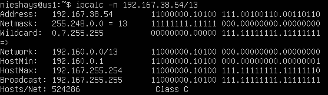

2) Преобразование маски 255.255.255.0 в префиксную и двоичную запись
- Чтобы преобразовать можно ввести команду **ipcalc 255.255.255.0** и увидеть префикс, который равен **24** и двоичную систему
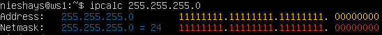 
- /15 в обычную и двоичную запись. Чтобы **/15** преобразовать в обычную запись можно использовать **ipcalc /15**, где будет показана и обычная запись и двоичная: 
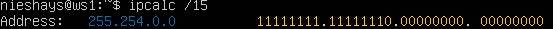
- 11111111.11111111.11111111.11110000 в обычную и префиксную запись. Для начала преобразуем двоичную в префиксную:
    1. Сначала считаем кол-во единиц:
        - 8 в первом октете
        - 8 во втором октете
        - 8 в третьем октете
        - 4 в четвертом, а остальные нули
    2. Суммируем: 8 + 8 + 8 + 4 = 28
    3. Значит, префикс равен /28
    4. Отсюда можем узнать и обычную запись введя команду **ipcalc /28**
    5. Она равняется **255.255.255.240**
    
    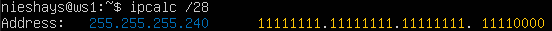
3) Минимальный и максимальный хосты в сети 12.167.38.4 при масках: /8, 11111111.11111111.00000000.00000000, 255.255.254.0 и /4
    1. Введя команду ipcalc **ipcalc 12.167.38.4/8** и нажав **enter**, можно увидеть строки **HostMin** и **HostMax**
        - HostMin: 12.0.0.1
        - HostMax: 12.255.255.254

    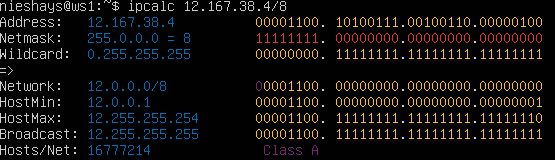

    2. Выполнив команду **ipcalc 12.167.38.4/16**, узнаем минимальный хост и максимальный:
        - HostMin: 12.167.0.1
        - HostMax: 12.167.255.254

    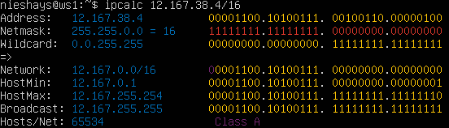

    3. Вводим команду **ipcalc 12.167.34.4 255.255.254.0**, узнаем минимальный хост и максимальный
        - HostMin: 12.167.38.1
        - HostMax: 12.167.39.254
        - Префикс: 23

    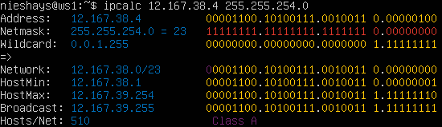

    4. Через префикс **/4** тоже самое: вводим команду **ipcalc 12.167.34.4/4**, видим хосты, которые нам нужны:
        - HostMin: 0.0.0.1
        - HostMax: 15.255.255.254

    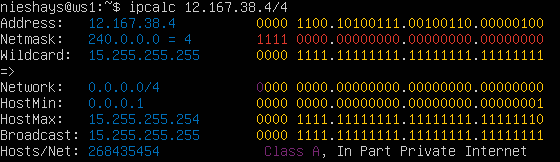
    
#### 1.2. локальный хостинг
- Определите и запишите в отчёт, можно ли обратиться к приложению, работающему на localhost, со следующими IP-адресами: **194.34.23.100**, **127.0.0.2**, **127.1.0.1**, **128.0.0.1**
- К IP-адресам **194.34.23.100** и **128.0.0.1** нельзя обратиться, так как первый является общедоступным и не относится к диапазону адресов зарезервированных для localhost. А второй (128.0.0.1) также является общедоступным, но не относится к диапазону зарезервированных адресов
- У IP-адресов **127.0.0.2** и **127.1.0.1** есть обратная петля (loopback), т.е. они зарезервированы для localhost и к ним можно обратиться   
#### 1.3. Диапазоны и сегменты сетей
- Определи и запиши в отчёт:
- 1) Какие из перечисленных IP можно использовать в качестве публичного, а какие только в качестве частных: **10.0.0.45**, **134.43.0.2**, **192.168.4.2**, **172.20.250.4**, **172.0.2.1**, **192.172.0.1**, **172.68.0.2**, **172.16.255.255**, **10.10.10.10**, **192.169.168**.
- Диапазон ip-адресов, зарезервированных для частных сетей:
    - **10.0.0.0/8**: (от 10.0.0.0 до 10.255.255.255)
    - **172.16.0.0/12**: (от 172.16.0.0 до 172.31.255.255)
    - **192.168.0.0/16**: (от 192.168.0.0 до 192.168.255.255)
- Отсюда можно определить какие ip-адреса можно использовать как частные, а какие как публичные:
    1. **10.0.0.45** - Частный
    2. **134.43.0.2** - Публичный
    3. **192.168.4.2** - Частный
    4. **172.20.250.4** - Частный
    5. **172.0.2.1** - Публичный
    6. **192.172.0.1** - Публичный
    7. **172.68.0.2** - Публичный
    8. **172.16.255.255** - Частный
    9. **10.10.10.10** - Частный
    10. **192.169.168.1** - Публичный

- 2) Какие из перечисленных IP-адресов шлюза возможны для сети **10.10.0.0/18**: 10.0.0.1, 10.10.0.2, 10.10.10.10, 10.10.100.1, 10.10.1.1
    - Для начала нужно узнать попадают ли предложенные ip-адреса в диапазон допустимых адресов этой сети
    1) Адрес сети **10.10.0.0/18** (двоичное представление **00001010.00001010.00000000.00000000**)
    2) Широковещательный адрес **10.10.63.255** получается путем преобразования **/18** в двоичный код. Это означает что первые 18 бит будут равны **1**, а остальные 14 равны **0** (**11111111.11111111.11000000.00000000**). Так как последние 14 бит определяют хост. Эти 14 бит нужно заменить на 1:
        - Получается: **00001010.00001010.00111111.11111111**. Это и будет широковещательный адрес
        - Преобразуем в десятичный вид:
        - 00001010 = 10
        - 00001010 = 10
        - 00111111 = 63
        - 11111111 = 255
        - Десятичный вид: **10.10.63.255**
    3) Теперь осталось проверить ip-адреса на вход в этот диапазон (от 10.10.0.0 до 10.10.63.255)
        - **10.0.0.1** - Не подходит
        - **10.10.0.2** - Подходит
        - **10.10.10.10** - Подходит
        - **10.10.100.1** - Не подходит
        - **10.10.1.255** - Подходит


    
## Часть 2. Статическая маршрутизация между двумя машинами

**==Задание==**

##### Подними две виртуальные машины (далее -- ws1 и ws2).

##### С помощью команды `ip a` посмотри существующие сетевые интерфейсы.
- В отчёт помести скрин с вызовом и выводом использованной команды.

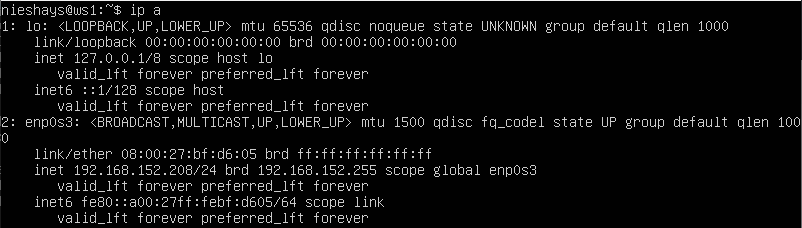 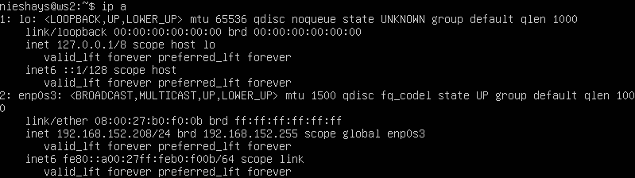

##### Опиши сетевой интерфейс, соответствующий внутренней сети, на обеих машинах и задай следующие адреса и маски: ws1 — *192.168.100.10*, маска */16*, ws2 — *172.24.116.8*, маска */12*.
- В отчёт помести скрины с содержанием изменённого файла *etc/netplan/00-installer-config.yaml* для каждой машины.

- На обеих машинах используется сетевой интерфейс: **enp0s3**

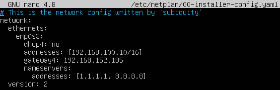 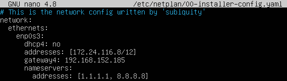

##### Выполни команду `netplan apply` для перезапуска сервиса сети.
- В отчёт помести скрин с вызовом и выводом использованной команды.

- Команда netplan на экран ничего не выводит, она просто перезагружает сервис.

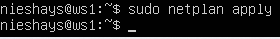 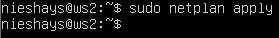

#### 2.1. Добавление статического маршрута вручную
##### Добавь статический маршрут от одной машины до другой и обратно при помощи команды вида `ip r add`.
- Для машины ws1 нужно указать статический ip-адрес машины ws2 **sudo ip route add 172.24.116.8/32** (**/32** Это маска 255.255.255.255, которая означает, что все биты IP-адреса относятся к хосту.)
- Для машины ws2 нужно указать статический ip-адрес машины ws1 **sudo ip route add 192.168.100.10/32**
##### Пропингуй соединение между машинами.
- В отчёт помести скрин с вызовом и выводом использованных команд.

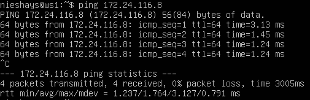 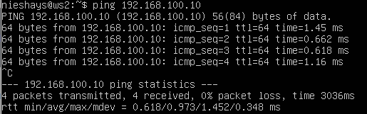

#### 2.2. Добавление статического маршрута с сохранением
##### Перезапусти машины.

##### Добавь статический маршрут от одной машины до другой с помощью файла */etc/netplan/00-installer-config.yaml*.
- В отчёт помести скрин с содержанием изменённого файла */etc/netplan/00-installer-config.yaml*.

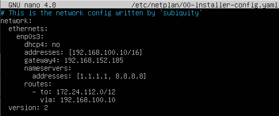 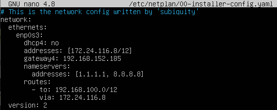

##### Пропингуй соединение между машинами.
- В отчёт помести скрин с вызовом и выводом использованной команды.

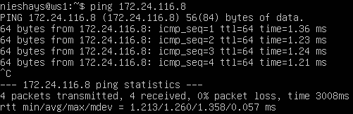 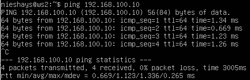


## Part 3. Утилита **iperf3**

**== Задание ==**

*В данном задании используются виртуальные машины ws1 и ws2 из Части 2*

#### 3.1. Скорость соединения
##### Переведи и запиши в отчёт: 8 Мбит/с в МБ/с, 100 МБ/с в Кбит/с, 1 Гбит/с в Мбит/с.

- 8 Мбит/с = 1 МБ/с
- 100 МБ/с = 819200 Кбит/с
- 1 Гбит/с = 1024 Мбит/с

#### 3.2. Утилита **iperf3**
##### Измерь скорость соединения между ws1 и ws2.
- В отчёт помести скрины с вызовом и выводом использованных команд.

- Для того, чтобы проверить соединение между машинами ws1 и ws2, нужно: 
    1. Сначала запустить ws2 утилитой c флагом **iperf3 -s**. Флаг **-s** говорит утилите запустить машину **ws2** в режиме сервера.
    2. Потом в **ws1** написать команду **iperf -c 172.24.116.8 -t 20 -i 1**
        - **-с**: Машина **ws1** запускается в режиме клиента и обращается к **ws2** по ip-адресу **172.24.116.8**
        - **-t**: Указывается продолжительность теста в секундах (по умолчанию 10 секунд).
        - **-i**: Указывается интервал вывода статистики в секундах (по умолчанию 0 секунд). 
    3. Чтобы проверить соединение я временно отключил farewall командой **sudo ufw desable**
        - Пропускная способность: ~ 1.7 ГБит/с

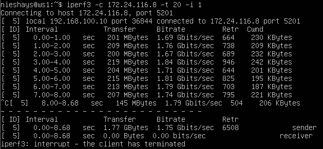 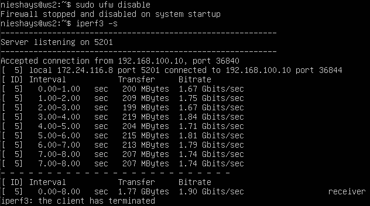


## Part 4. Сетевой экран

**==Задание==**

#### 4.1. Утилита **iptables**
##### Создай файл */etc/firewall.sh*, имитирующий файрвол, на ws1 и ws2:
```shell
#!/bin/sh

# Удаление всех правил в таблице «filter» (по умолчанию).
iptables -F
```
- Чтобы удалить все правила в таблице по умолчанию нужно ввести команду **sudo iptables -F**.

##### Нужно добавить в файл подряд следующие правила:
##### 1) На ws1 примени стратегию, когда в начале пишется запрещающее правило, а в конце пишется разрешающее правило (это касается пунктов 4 и 5).
##### 2) На ws2 примени стратегию, когда в начале пишется разрешающее правило, а в конце пишется запрещающее правило (это касается пунктов 4 и 5).
##### 3) Открой на машинах доступ для порта 22 (ssh) и порта 80 (http).
##### 4) Запрети *echo reply* (машина не должна «пинговаться», т. е. должна быть блокировка на OUTPUT).
##### 5) Разреши *echo reply* (машина должна «пинговаться»).
- В отчёт помести скрины с содержанием файла */etc/firewall* для каждой машины.

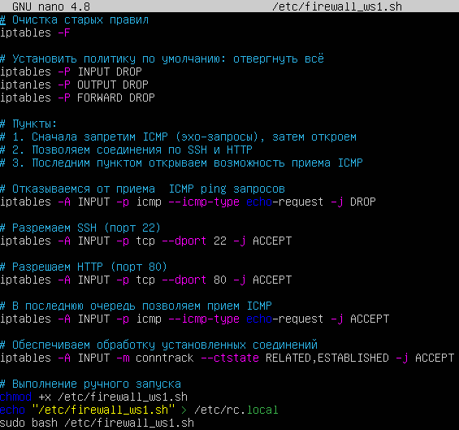 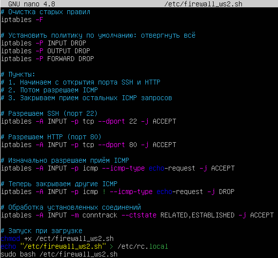

##### Запусти файлы на обеих машинах командами `chmod +x /etc/firewall.sh` и `/etc/firewall.sh`.
- В отчёт помести скрины с запуском обоих файлов.

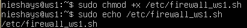 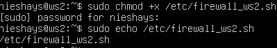

- В отчёте опиши разницу между стратегиями, применёнными в первом и втором файлах.

- WS1:
    - В файле /etc/firewall_ws1.sh сначала применяется запрещающее правило, а затем разрешающее. Это означает, что сначала блокируются все входящие запросы, а затем разрешаются только те, которые необходимы (например, SSH и HTTP). Это обеспечивает более строгий контроль доступа и минимизирует риск несанкционированного доступа.
- WS2:
    - В файле /etc/firewall_ws2.sh сначала применяется разрешающее правило, а затем запрещающее. Это означает, что сначала разрешаются все необходимые запросы, а затем блокируются все остальные. Это позволяет быстрее настроить доступ к необходимым сервисам, но требует более тщательного контроля за правилами блокировки

#### 4.2. Утилита **nmap**
##### Командой **ping** найди машину, которая не «пингуется», после чего утилитой **nmap** покажи, что хост машины запущен.
*Проверка: в выводе nmap должно быть сказано: `Host is up`*.
- В отчёт помести скрины с вызовом и выводом использованных команд **ping** и **nmap**.

- Если не установленна утилита **nmap**, устанавливаем её при помощи команды **sudo apt install nmap** на обеих машинах.

- Далее зная точный ip-адрес каждой машины проверим пингуются ли они между собой

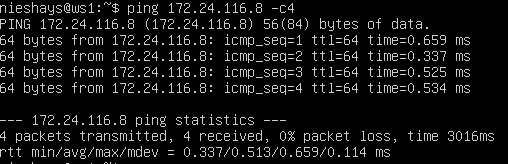 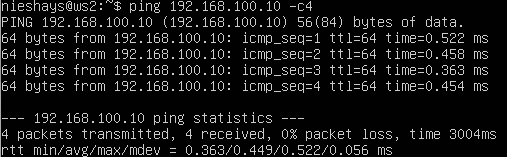

- Проверяем запущен ли хост машины через команду **sudo nmap -sn ip-адрес машины**

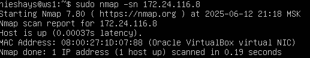 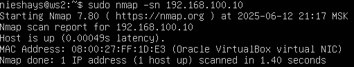


## Part 5. Статическая маршрутизация сети

**== Задание ==**

##### Подними пять виртуальных машин (3 рабочие станции (ws11, ws21, ws22) и 2 роутера (r1, r2)).

#### 5.1. Настройка адресов машин
##### Настрой конфигурации машин в *etc/netplan/00-installer-config.yaml* согласно сети на рисунке.
- В отчёт помести скрины с содержанием файла *etc/netplan/00-installer-config.yaml* для каждой машины.

1) ws11 

- 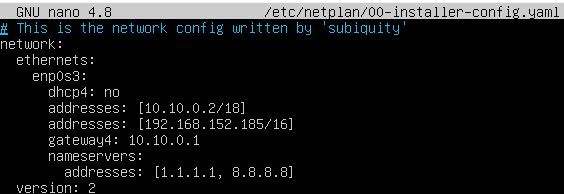

2) ws21

- 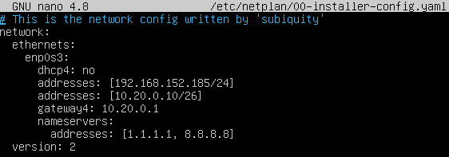 

3) ws22

- 

4) r1

- 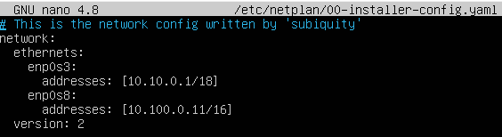

5) r2

- 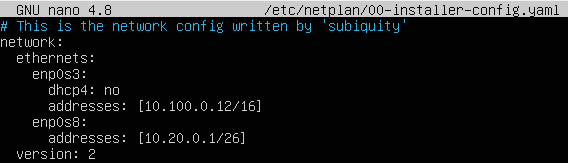

##### Перезапусти сервис сети. Если ошибок нет, командой `ip -4 a` проверь, что адрес машины задан верно. Также пропингуй ws22 с ws21. Аналогично пропингуй r1 с ws11.
- В отчёт помести скрины с вызовом и выводом использованных команд.

- Здесь через команду **ip -4 a** проверяется правильно заданный адрес машины:

1) ws11

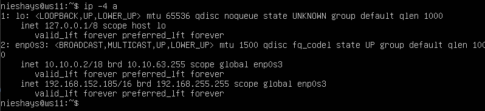 

2) ws21

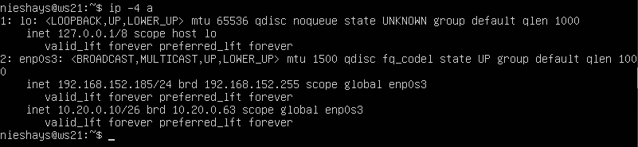 

3) ws22

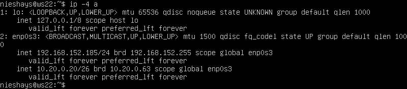

4) r1

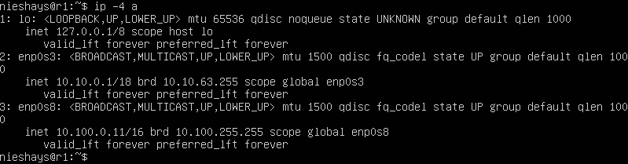 

5) r2

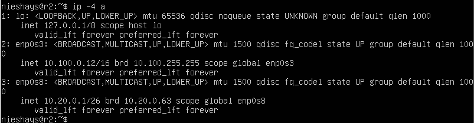

- Далее проверяю связь машины ws22 c машиной ws21

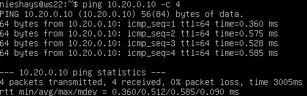

- И связь r1 с ws11

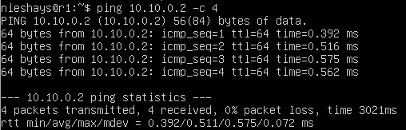


#### 5.2. Включение переадресации IP-адресов
##### Для включения переадресации IP выполни команду на роутерах:
`sysctl -w net.ipv4.ip_forward=1`
*При таком подходе переадресация не будет работать после перезагрузки системы.*
- В отчёт помести скрин с вызовом и выводом использованной команды.

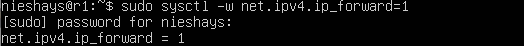 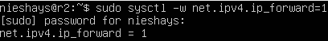

##### Открой файл */etc/sysctl.conf* и добавь в него следующую строку:
`net.ipv4.ip_forward = 1`
*При использовании этого подхода, IP-переадресация включена на постоянной основе.*
- В отчёт помести скрин с содержанием изменённого файла */etc/sysctl.conf*.

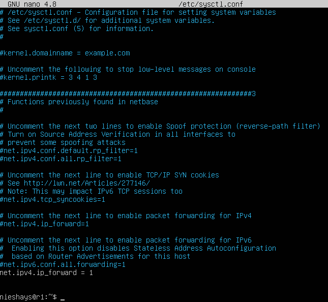 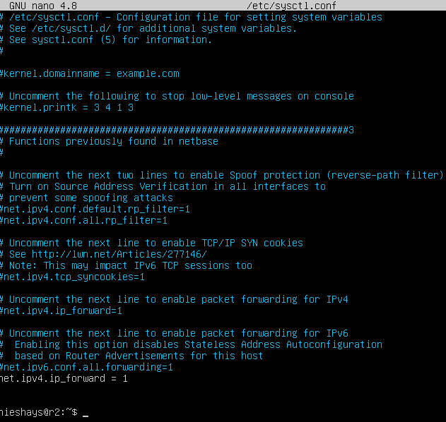


#### 5.3. Установка маршрута по умолчанию
Пример вывода команды `ip r` после добавления шлюза:
```
default via 10.10.0.1 dev eth0
10.10.0.0/18 dev eth0 proto kernel scope link src 10.10.0.2
```
##### Настрой маршрут по умолчанию (шлюз) для рабочих станций. Для этого добавь `default` перед IP-роутера в файле конфигураций.
- В отчёт помести скрин с содержанием файла *etc/netplan/00-installer-config.yaml*;

- ws11  
- ws21   
- ws22 

##### Вызови `ip r` и покажи, что добавился маршрут в таблицу маршрутизации.
- В отчёт помести скрин с вызовом и выводом использованной команды.

- ws11 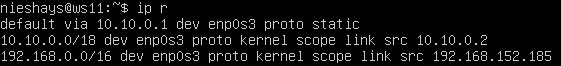
- ws21 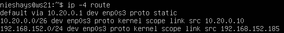
- ws22 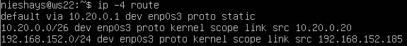

##### Пропингуй с ws11 роутер r2 и покажи на r2, что пинг доходит. Для этого используй команду:
`tcpdump -tn -i eth0`
- В отчёт помести скрин с вызовом и выводом использованных команд.

- Для того, чтобы успешно пропинговать **r2** с машины **ws11**, необходимо установить связь между маршрутизаторами **r1** и **r2**.
- Для **r1** нужно прописать команду используя схему **sudo ip route add 10.20.0.0/26 via 10.100.0.12**
- Для **r2** аналогично **sudo ip route add 10.10.0.0/18 via 10.100.0.11**

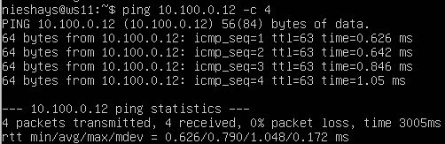 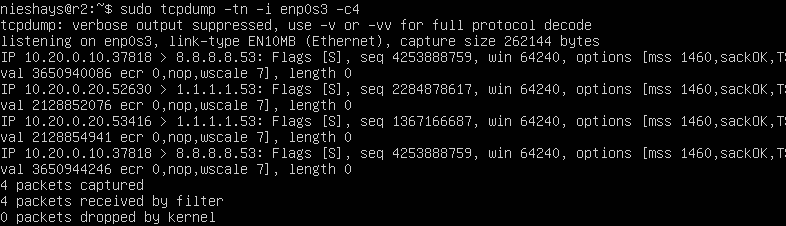


#### 5.4. Добавление статических маршрутов
##### Добавь в роутеры r1 и r2 статические маршруты в файле конфигураций. Пример для r1 маршрута в сетку 10.20.0.0/26:
```shell
# Добавь в конец описания сетевого интерфейса eth1:
- to: 10.20.0.0
  via: 10.100.0.12
```
- В отчёт помести скрины с содержанием изменённого файла *etc/netplan/00-installer-config.yaml* для каждого роутера.

 

##### Вызови `ip r` и покажи таблицы с маршрутами на обоих роутерах. Пример таблицы на r1:
```
10.100.0.0/16 dev eth1 proto kernel scope link src 10.100.0.11
10.20.0.0/26 via 10.100.0.12 dev eth1
10.10.0.0/18 dev eth0 proto kernel scope link src 10.10.0.1
```
- В отчёт помести скрин с вызовом и выводом использованной команды.

 

##### Запусти команды на ws11:
`ip r list 10.10.0.0/[маска сети]` и `ip r list 0.0.0.0/0`
- В отчёт помести скрин с вызовом и выводом использованных команд;


- В отчёте объясни, почему для адреса 10.10.0.0/\[маска сети\] был выбран маршрут, отличный от 0.0.0.0/0, хотя он попадает под маршрут по умолчанию.

- Это означает, что трафик в сеть **10.10.0.0/18** отправляется напрямую через интерфейс enp0s3, так как **ws11** сам находится в этой сети (10.10.0.2/18).
- А весь остальной трафик (не попадающий в локальные сети) отправляется через шлюз **10.10.0.1** (r1). **0.0.0.0/0** - маршрут по-умолчанию и используется только для "неизвестных" сетей

#### 5.5. Построение списка маршрутизаторов
Пример вывода утилиты **traceroute** после добавления шлюза:
```
1 10.10.0.1 0 ms 1 ms 0 ms
2 10.100.0.12 1 ms 0 ms 1 ms
3 10.20.0.10 12 ms 1 ms 3 ms
```
##### Запусти на r1 команду дампа:
`tcpdump -tnv -i eth0`
##### При помощи утилиты **traceroute** построй список маршрутизаторов на пути от ws11 до ws21.
- В отчёт помести скрины с вызовом и выводом использованных команд (tcpdump и traceroute);

 

- В отчёте, опираясь на вывод, полученный из дампа на r1, объясни принцип работы построения пути при помощи **traceroute**.

- traceroute — это утилита, которая определяет путь пакетов от исходного узла до целевого, используя TTL (Time To Live) в IP-заголовках.
- Алгоритм работы:
    1. Отправляет пакет с TTL=1. Первый роутер (r1) уменьшает TTL до 0, отбрасывает пакет и отправляет обратно сообщение ICMP Time Exceeded.
    2. Отправляет пакет с TTL=2. Второй роутер (r2) уменьшает TTL до 0 и также возвращает ошибку.
    3. Процесс повторяется, пока пакет не достигнет цели (ws21), которая отвечает ICMP Echo Reply.

- Дамп **r1** показывает, что роутер корректно обрабатывает TTL и возвращает ICMP-сообщения.

#### 5.6. Использование протокола **ICMP** при маршрутизации
##### Запусти на r1 перехват сетевого трафика, проходящего через eth0 с помощью команды:
`tcpdump -n -i eth0 icmp`
##### Пропингуй с ws11 несуществующий IP (например, *10.30.0.111*) с помощью команды:
`ping -c 1 10.30.0.111`
- В отчёт помести скрин с вызовом и выводом использованных команд.

 

##### Сохрани дампы образов виртуальных машин.


**P.S. Ни в коем случае не сохраняй дампы в гит!**


## Part 6. Динамическая настройка IP с помощью **DHCP**

`-` Следующим нашим шагом будет более подробное знакомство со службой **DHCP**, которую ты уже знаешь.

**== Задание ==**

*В данном задании используются виртуальные машины из Части 5.*

##### Для r2 настрой в файле */etc/dhcp/dhcpd.conf* конфигурацию службы **DHCP**:
##### 1) Укажи адрес маршрутизатора по умолчанию, DNS-сервер и адрес внутренней сети. Пример файла для r2:
```shell
subnet 10.100.0.0 netmask 255.255.0.0 {}

subnet 10.20.0.0 netmask 255.255.255.192
{
    range 10.20.0.2 10.20.0.50;
    option routers 10.20.0.1;
    option domain-name-servers 10.20.0.1;
}
```

Чтобы открыть файл конфигурацию службы **DHCP**, нужно ввести команду **sudo nano /etc/dhcp/dhcpd.conf** находим строку **#subnet 10.20.0.0/26...** и вводим необходимые данные: диапазон ip-адресов, адрес маршрутизатора и т.д.


##### 2) В файле *resolv.conf* пропиши `nameserver 8.8.8.8`.
- В отчёт помести скрины с содержанием изменённых файлов.


##### Перезагрузи службу **DHCP** командой `systemctl restart isc-dhcp-server`. Машину ws21 перезагрузи при помощи `reboot` и через `ip a` покажи, что она получила адрес. Также пропингуй ws22 с ws21.
- В отчёт помести скрины с вызовом и выводом использованных команд.


##### Укажи MAC-адрес у ws11, для этого в *etc/netplan/00-installer-config.yaml* надо добавить строки: `macaddress: 10:10:10:10:10:BA`, `dhcp4: true`.
- В отчёт помести скрин с содержанием изменённого файла *etc/netplan/00-installer-config.yaml*.


Для проверки МАС-адреса нужно ввести команду **sudo ip link show enp0s3**


##### Для r1 настрой аналогично r2, но сделай выдачу адресов с жесткой привязкой к MAC-адресу (ws11). Проведи аналогичные тесты.
- В отчёте этот пункт опиши аналогично настройке для r2.
- Для того, чтобы работал пинг между **r1** и **ws11** ОЧЕНЬ ВАЖНО в настройках сети машины указать мас-адрес `macaddress: 10:10:10:10:10:BA`. Иначе пинг работать не будет. Не в файле ..config.yaml, а именно в самой машине.
- В файле dhcpd.conf пишем тоже самое, что и в r2, только добавляем запись 
```shell
host ws11 {
    hardware ethernet 10:10:10:10:10:BA;  # MAC должен совпадать с реальным!
    fixed-address 10.10.0.2;             # IP, который получит ws11
}
```

 

- Для проверки, что все правильно работает, нужно сделать пинг r1 с машины ws11


##### Запроси с ws21 обновление IP-адреса.
- В отчёте помести скрины IP до и после обновления.
- До обновления:


- Для начала нужно освободить машину от текущего DHCP-адреса через команду **sudo dhclient -r enp0s3**. Эта команда удалит текущий адрес.
- Далее нужно запросить новый адрес у DHCP-сервера (r2) через команду **sudo dhclient enp0s3**.
- После обновления: 


- В отчёте опиши, какими опциями **DHCP** сервера пользовался в данном пункте.
- Проверим, все ли правильно работает. Для этого пропингуем r2 с машины ws21.


## Part 7. **NAT**
`-` Ну и в конце в качестве вишенки на торте я расскажу тебе про механизм преобразования адресов.

**== Задание ==**

*В данном задании используются виртуальные машины из Части 5.*
##### В файле */etc/apache2/ports.conf* на ws22 и r1 измени строку `Listen 80` на `Listen 0.0.0.0:80`, то есть сделай сервер Apache2 общедоступным.
- В отчёт помести скрин с содержанием изменённого файла.

 

##### Запусти веб-сервер Apache командой `service apache2 start` на ws22 и r1.
- В отчёт помести скрины с вызовом и выводом использованной команды.
- Через команду **sudo service apache2 status** можно проверить что служба запущена

 

##### Добавь в фаервол, созданный по аналогии с фаерволом из Части 4, на r2 следующие правила:
##### 1) Удаление правил в таблице filter — `iptables -F`;
##### 2) Удаление правил в таблице «NAT» — `iptables -F -t nat`;
##### 3) Отбрасывать все маршрутизируемые пакеты — `iptables --policy FORWARD DROP`.
##### Запусти файл также, как в Части 4.
##### Проверь соединение между ws22 и r1 командой `ping`.
*При запуске файла с этими правилами, ws22 не должна «пинговаться» с r1.*
- В отчёт помести скрины с вызовом и выводом использованной команды.

 

##### Добавь в файл ещё одно правило:
##### 4) Разрешить маршрутизацию всех пакетов протокола **ICMP**.
##### Запусти файл также, как в Части 4.
##### Проверь соединение между ws22 и r1 командой `ping`.
*При запуске файла с этими правилами, ws22 должна «пинговаться» с r1.*
- В отчёт помести скрины с вызовом и выводом использованной команды.

 

##### Добавь в файл ещё два правила:
##### 5) Включи **SNAT**, а именно маскирование всех локальных IPиз локальной сети, находящейся за r2 (по обозначениям из Части 5 — сеть 10.20.0.0).
*Совет: стоит подумать о маршрутизации внутренних пакетов, а также внешних пакетов с установленным соединением.*
##### 6) Включи **DNAT** на 8080 порт машины r2 и добавить к веб-серверу Apache, запущенному на ws22, доступ извне сети.
*Совет: стоит учесть, что при попытке подключения возникнет новое tcp-соединение, предназначенное ws22 и 80 порту.*
- В отчёт помести скрин с содержанием изменённого файла.


##### Запусти файл также, как в Части 4.
*Перед тестированием рекомендуется отключить сетевой интерфейс **NAT** (его наличие можно проверить командой `ip a`) в VirtualBox, если он включен.*
##### Проверь соединение по TCP для **SNAT**: для этого с ws22 подключиться к серверу Apache на r1 командой:
`telnet [адрес] [порт]`


##### Проверь соединение по TCP для **DNAT**: для этого с r1 подключиться к серверу Apache на ws22 командой `telnet` (обращаться по адресу r2 и порту 8080).
- В отчёт помести скрины с вызовом и выводом использованных команд.


##### Сохрани дампы образов виртуальных машин.
**P.S. Ни в коем случае не сохраняй дампы в гит!**


## Part 8. Дополнительно. Знакомство с **SSH Tunnels**

##### Запусти на r2 фаервол с правилами из Части 7.
- Чтобы выполнить этот пункт, нужно:
    1. Открыть r2
    2. Написать команду **sudo ufw enable**, чтобы запустить farewall
##### Запусти веб-сервер **Apache** на ws22 только на localhost (то есть в файле */etc/apache2/ports.conf* измени строку `Listen 80` на `Listen localhost:80`).
- Для того, чтобы запистить веб-сервер **Apache** на ws22 только на localhost нужно открыть файл при помощи команды **sudo nano /etc/apache2/ports.conf**
 изменяем строку `Listen 80` на `Listen localhost:80`

 

##### Воспользуйся *Local TCP forwarding* с ws21 до ws22, чтобы получить доступ к веб-серверу на ws22 с ws21.
- Чтобы получить доступ к веб-серверу на ws22 с ws21 нужно ввести команду **sudo ssh -L 8080:localhost:80 nieshays@10.20.0.20** (пользователь@адрес ws22).
После ввода пароля ws21 соединяется с ws22


##### Воспользуйся *Remote TCP forwarding* c ws11 до ws22, чтобы получить доступ к веб-серверу на ws22 с ws11.

- Это задание так и не удалось выполнить

##### Для проверки, сработало ли подключение в обоих предыдущих пунктах, перейди во второй терминал (например, клавишами Alt + F2) и выполни команду:
`telnet 127.0.0.1 [локальный порт]`
- В отчёте опиши команды, необходимые для выполнения этих четырёх пунктов, а также приложи скриншоты с их вызовом и выводом.


##### Сохрани дампы образов виртуальных машин.
**P.S. Ни в коем случае не сохраняй дампы в гит!**