## Part 1. Готовый докер

В качестве конечной цели своей небольшой практики ты сразу выбрал написание докер-образа для собственного веб-сервера, а потому в начале тебе нужно разобраться с уже готовым докер-образом для сервера.
Твой выбор пал на довольно простой **nginx**.

**== Задание ==**

##### Возьми официальный докер-образ с **nginx** и выкачай его при помощи `docker pull`.
- Первым делом нужно установить сам докер на виртуальную машину при помощи команды **sudo apt install docker.io -y**
- Затем ввести команду **sudo docker pull nginx**, скачается официальный докер-образ

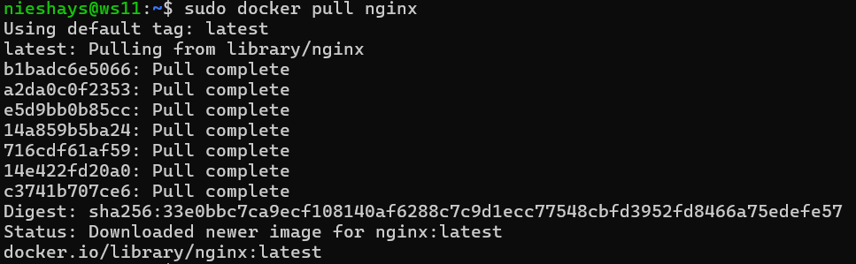

##### Проверь наличие докер-образа через `docker images`.

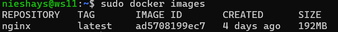

##### Запусти докер-образ через `docker run -d [image_id|repository]`.
- Для закуска этой команды нужны права **root**, для этого нужно в начале команды ввести **sudo docker run -d ad5708199ec7 nginx** (где **ad5708199ec7** образ докера)

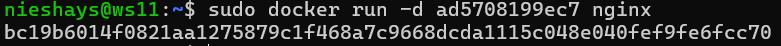

##### Проверь, что образ запустился через `docker ps`.

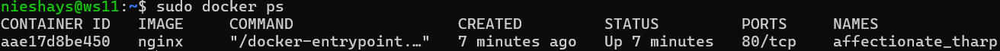

##### Посмотри информацию о контейнере через `docker inspect [container_id|container_name]`.
- Я взял id-контейнера из команды **docker ps** и вставил его в команду **sudo docker inspect aae17d8be450**
- Команда возвращает JSON-структуру со всеми данными контейнера

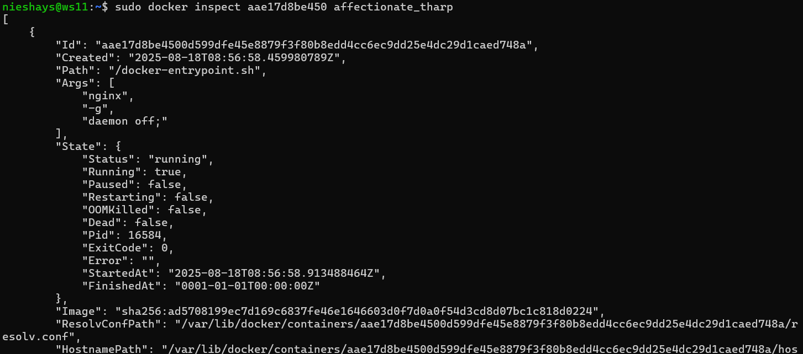

##### По выводу команды определи и помести в отчёт размер контейнера, список замапленных портов и ip контейнера.
- Размер контейнера - 192MB
- Список замапленных (подключенных) портов - 80/tcp
- Ip-адрес контейнера 172.17.0.2

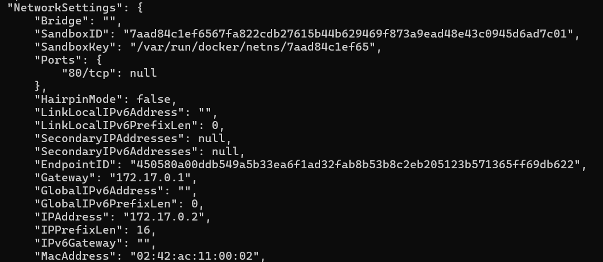

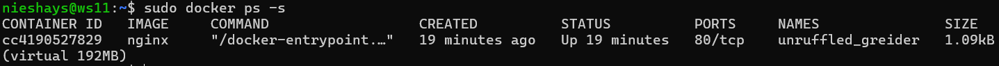

##### Останови докер контейнер через `docker stop [container_id|container_name]`.
- Для того чтобы остановить докер, необходимо ввести команду **sudo docker stop cc4190527829**
- А чтобы узнать нужно ввести **sudo docker images**
##### Проверь, что контейнер остановился через `docker ps`.

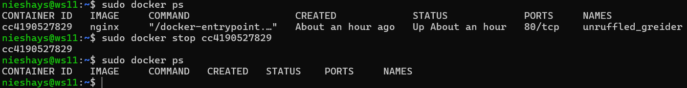

##### Запусти докер с портами 80 и 443 в контейнере, замапленными на такие же порты на локальной машине, через команду *run*.
- В этом пункте возникла ошибка с соединением к порту 80, так как он был занят. Занятость порта я проверил командой **sudo netstat -tulpn | grep :80**
- Из вывода стало понятно, что порт занят системным **nginx**
- Освободил порт командой: **sudo systemctl stop nginx** (команда, которая остановила системный nginx)
- И попробовал заново запустить докер **sudo docker run -d -p 80:80 -p 443:443 nginx**

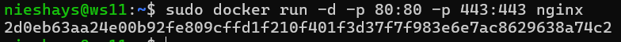

##### Проверь, что в браузере по адресу *localhost:80* доступна стартовая страница **nginx**.
- В браузере в строке для URL-запроса вводим **http://10.90.22.80:80**

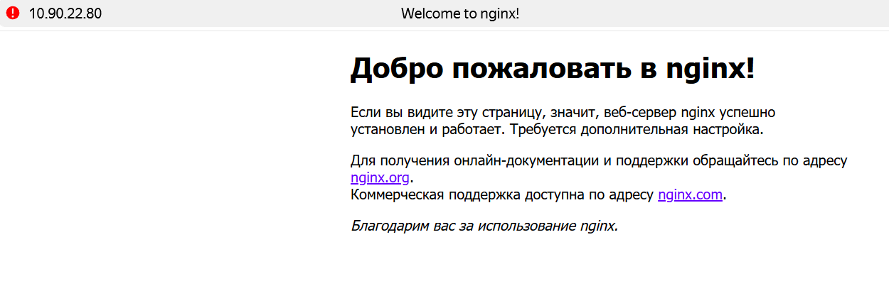

##### Перезапусти докер контейнер через `docker restart [container_id|container_name]`.
- Чтобы перезапустить docker контейнер нужно прописать команду **sudo docker restart cc4190527829** 

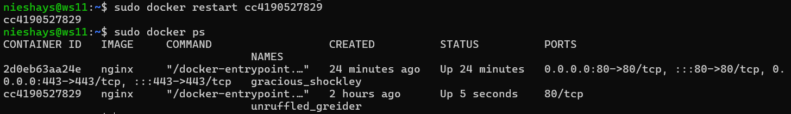
##### Проверь любым способом, что контейнер запустился.
- Я проверил запущен ли контейнер через команду **sudo docker ps**
- После запуска этой команды можно увидеть все контейнера, которые работают 

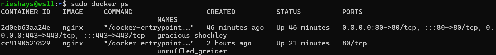

- В отчёт помести скрины:
  - вызова и вывода всех использованных в этой части задания команд;
  - стартовой страницы **nginx** по адресу *localhost:80* (адрес должен быть виден).
  
*Замечание:* **Не загружай тяжелые файлы (>10 мб) в гит.**


## Part 2. Операции с контейнером

Докер-образ и контейнер готовы. Теперь можно покопаться в конфигурации **nginx** и отобразить статус страницы.

**== Задание ==**

##### Прочитай конфигурационный файл *nginx.conf* внутри докер контейнера через команду *exec*.
- Чтобы прочитать конфигурационный файл, нужно сначала запустить докер контейнер:
  1. Ввести команду **sudo docker ps -a**. Этой командой узнаем id нашего контейнера.
  2. Копируем id контейнера
  3. Запускаем контейнер через команду **sudo docker start cc4190527829** (***cc4190527829*** - это номер моего контейнера)
  4. Далее введя команду **sudo docker exec cc4190527829 cat /etc/nginx/nginx.conf** читаем конфигурационный файл

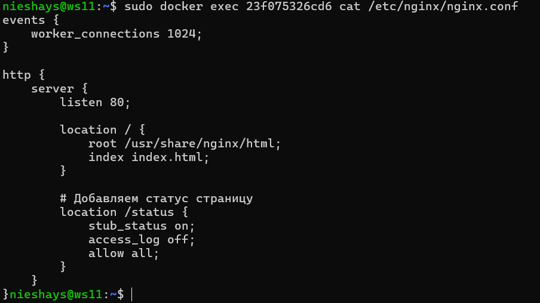

##### Создай на локальной машине файл *nginx.conf*.
- Для создания файла ***nginx.conf*** на локальной машине, нужно в терминале ввести команду **ni nginx.conf** (Эта команда создаёт файл через PowerShell nginx.conf)

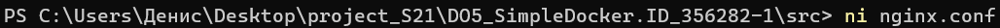

- Для редактирования файла нужно ввести команду **code .\nginx.conf**. Эта команда откроет Visual Studio Code (если он есть), и уже там можно редактировать файл.


##### Настрой в нем по пути */status* отдачу страницы статуса сервера **nginx**.

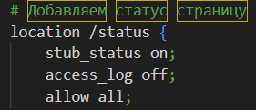

- Здесь специальное местоположение для статуса
  1. Включается статус-страница
  2. Отключаются логи для этого пути
  3. Разрешается доступ всем

##### Скопируй созданный файл *nginx.conf* внутрь докер-образа через команду `docker cp`.
- Для начала нужно скопировать файл конфигурации **nginx.conf** с локального компьютера на фиртуальную машину при помощи команды:
**scp "C:\Users\Денис\Desktop\project_S21\DO5_SimpleDocker.ID_356282-1\src\nginx.conf nieshays@10.90.22.80:/home/nieshays/DO5**

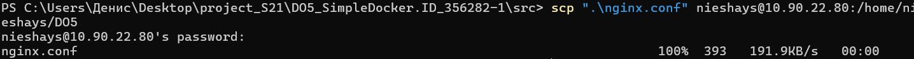

- Перейти в директорию куда скопировали файл, то есть в DO5 на виртуальной машине
- Затем скопировать файл внутрь докер-образа командой **sudo docker cp nginx.conf cc4190527829:/etc/nginx/nginx.conf**

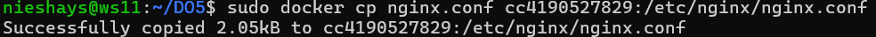

##### Перезапусти **nginx** внутри докер-образа через команду *exec*.
- Для перезапуска образа нужно прописать команду **sudo docker exec cc4190527829 nginx -s reload**

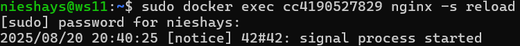

##### Проверь, что по адресу *localhost:80/status* отдается страничка со статусом сервера **nginx**.
- Для этой задачи мне пришлось создать новый контейнер при помощи команды **sudo docker run -d -r 80:80 -r 443:443 --name unruffled_greider nginx** (Так как старый контейнер был настроен только на стартовую страницу nginx и не давал проброс портов с хостовой машиной)

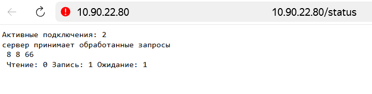

##### Экспортируй контейнер в файл *container.tar* через команду *export*.
- Сохраним образ **sudo docker save -o /home/nieshays/container.tar my-docker**

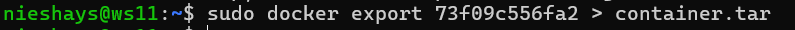

##### Останови контейнер.

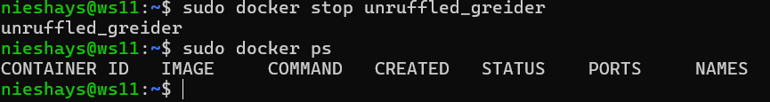

##### Удали образ через `docker rmi [image_id|repository]`, не удаляя перед этим контейнеры.
- Нужно принудительно удалить образ добавив флаг **-f**, иначе нужно будет сперва удалить контейнер **sudo docker rmi -f ad5708199ec7 nginx**

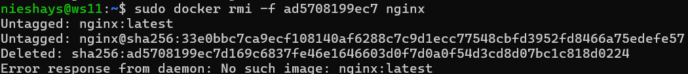

##### Удали остановленный контейнер.
- Удалить контейнер применяя команду **sudo docker rm 73f09c556fa2**

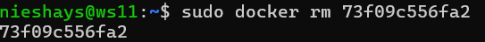

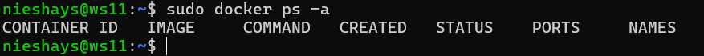

##### Импортируй контейнер обратно через команду *import*.
- Импортируется контейнер через команду **sudo docker import container.tar unruffled_greider**

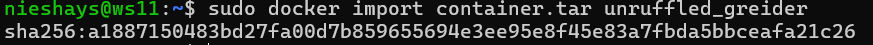

##### Запусти импортированный контейнер.
- Запуск импортированного контейнера через команду **sudo docker run -d -p 80:80 restored-nginx unruffled_greider nginx -g "daemon off;"

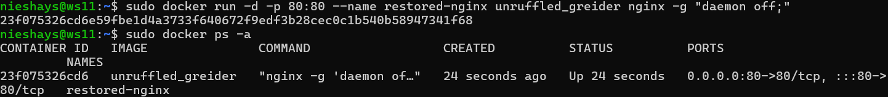

##### Проверь, что по адресу *localhost:80/status* отдается страничка со статусом сервера **nginx**.

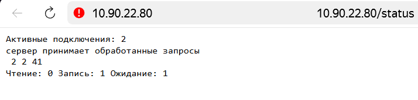

- В отчёт помести скрины:
  - вызова и вывода всех использованных в этой части задания команд;
  - содержимое созданного файла *nginx.conf*;
  - страницы со статусом сервера **nginx** по адресу *localhost:80/status*.


## Part 3. Мини веб-сервер

Теперь стоит немного оторваться от докера, чтобы подготовиться к последнему этапу. Время написать свой сервер.

**== Задание ==**

##### Напиши мини-сервер на **C** и **FastCgi**, который будет возвращать простейшую страничку с надписью `Hello, World!`.

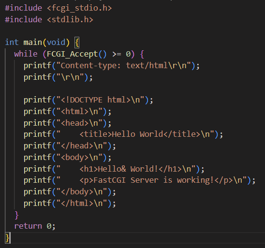

##### Запусти написанный мини-сервер через *spawn-fcgi* на порту 8080.
- Для этого нужно отурыть два окна виртуальной машины. Одно для запуска через **spawn-fcgi**, а другое для запуска файла nginx и проверки успешного запуска.

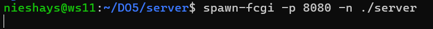

##### Напиши свой *nginx.conf*, который будет проксировать все запросы с 81 порта на *127.0.0.1:8080*.
##### Запусти локально **nginx** с написанной конфигурацией.

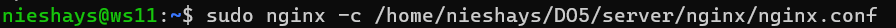

##### Проверь, что в браузере по *localhost:81* отдается написанная тобой страничка.

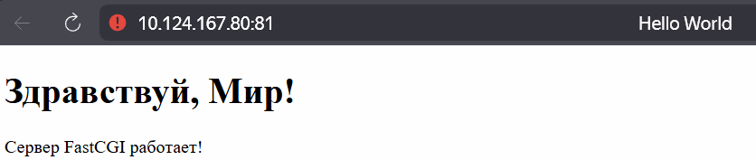

##### Положи файл *nginx.conf* по пути *./nginx/nginx.conf* (это понадобится позже).


## Part 4. Свой докер

Теперь всё готово. Можно приступать к написанию докер-образа для созданного сервера.

**== Задание ==**

*При написании докер-образа избегай множественных вызовов команд RUN*

#### Напиши свой докер-образ, который:
##### 1) собирает исходники мини сервера на FastCgi из [Части 3](#part-3-мини-веб-сервер);
##### 2) запускает его на 8080 порту;
##### 3) копирует внутрь образа написанный *./nginx/nginx.conf*;
##### 4) запускает **nginx**.
_**nginx** можно установить внутрь докера самостоятельно, а можно воспользоваться готовым образом с **nginx**'ом, как базовым._

##### Собери написанный докер-образ через `docker build` при этом указав имя и тег.
- Докер-образ собирается при помощи команды **sudo docker build -t my_docker_nieshays .** (Точка в конце обязательна, без неё работать не будет)
- ***Если памяти не хватает можно попробовать очистить кэш и удалить другие контейнера***
```
  sudo docker system prune -f
  sudo docker volume prune -f
  sudo docker builder prune -f
```

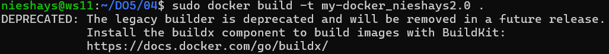

##### Проверь через `docker images`, что все собралось корректно.

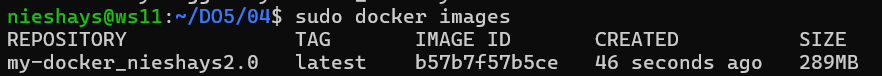

##### Запусти собранный докер-образ с маппингом 81 порта на 80 на локальной машине и маппингом папки *./nginx* внутрь контейнера по адресу, где лежат конфигурационные файлы **nginx**'а (см. [Часть 2](#part-2-операции-с-контейнером)).

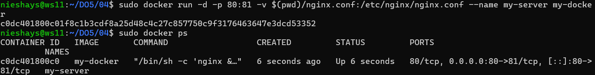

- ```sudo docker run -d -p 80:81 -v $(pwd)/nginx.conf:/etc/nginx/nginx.conf --name my-server my-docker```

##### Проверь, что по localhost:80 доступна страничка написанного мини сервера.

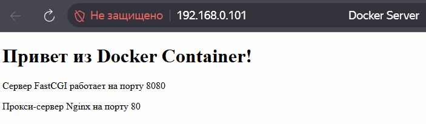

##### Допиши в *./nginx/nginx.conf* проксирование странички */status*, по которой надо отдавать статус сервера **nginx**.
##### Пересобери докер-образ.
- Для начала нужно остановить уже запущенный контейнер командой **sudo docker rm -f my_docker**
- Затем снова запустить образ **sudo docker run -d -p 80:81 --name my_docker my_docker_nieshays**

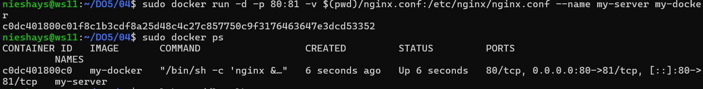

*Если всё сделано верно, то, после сохранения файла и перезапуска контейнера, конфигурационный файл внутри докер-образа должен обновиться самостоятельно без лишних действий*.
##### Проверь, что теперь по *localhost:80/status* отдается страничка со статусом **nginx**

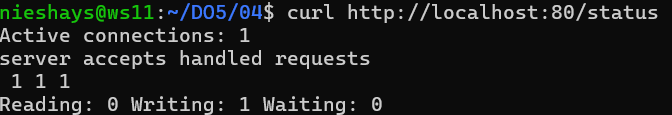

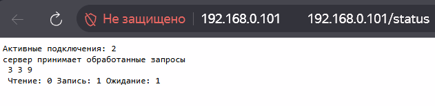


## Part 5. **Dockle**

После написания образа никогда не будет лишним проверить его на безопасность.

**== Задание ==**

##### Просканируй образ из предыдущего задания через `dockle [image_id|repository]`.
- Для начала нужно скачать и установить Dockle **sudo curl -L https://github.com/goodwithtech/dockle/releases/download/v0.4.11/dockle_0.4.11_Linux-64bit
.deb -o dockle.deb**

- Скачивание Dockle:

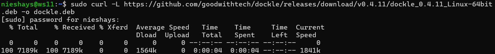

- Установка Dockle:

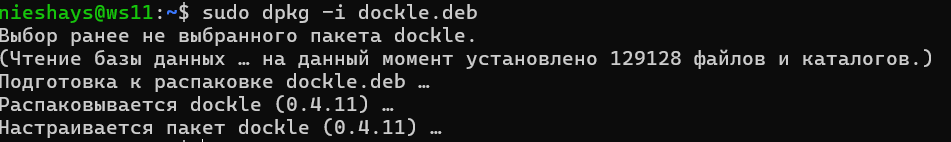

##### Исправь образ так, чтобы при проверке через **dockle** не было ошибок и предупреждений.
- Сначала нужно сохранить образ написав **sudo docker save -o nieshays.tar my-docker-nieshays:latest**
- После ввести команду **sudo dockle --input nieshays.tar** (container.tar - это место, куда мы сохранили образ и проверяем его через dockle)

- Проверка:

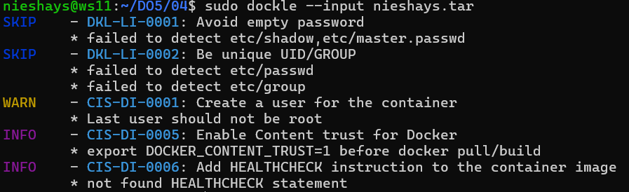

- Далее исправляется Dockerfile и заново пересобирается:
  1. **sudo docker build -t fixed-docker .**
  2. Можно через *docker images* проверить, что собрался новый образ
  3. Затем сохранить его в *.tar* **sudo docker save -o fixed.tar fixed-docker:latest**
  4. И непосредственно проверить файл *fixed.tar* еще раз **sudo dockle --input fixed.tar
  5. Запуск контейнера необходимо делать с ***root*** правами: **sudo docker run -d -p 80:80 --user root --name my-server my-docker**

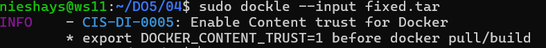

- Ошибка **CIS-DI-0005** является системной и не может быть исправлена в Dockerfile. Она означает, что docker не настроен для подписи образов. Но можно ее скрыть командой **sudo docker -i CIS-DI-0005 --input my-container.tar** 
```
(С моей точки зрения, на этом этапе нет необходимости настраивать подпись)
``` 

- Напрямую проверить не удается, так как dockle ищет файл в Docker Hub, а не в локальном хранилище, где находится мои образы. Поэтому пришлось использовать альтернативный способ проверки файла. 


## Part 6. Базовый **Docker Compose**

Вот ты и закончил свою разминку. А хотя погоди...
Почему бы не поэкспериментировать с развёртыванием проекта, состоящего сразу из нескольких докер-образов?

**== Задание ==**

##### Напиши файл *docker-compose.yml*, с помощью которого:
##### 1) Подними докер-контейнер из [Части 5](#part-5-инструмент-dockle) _(он должен работать в локальной сети, т. е. не нужно использовать инструкцию **EXPOSE** и мапить порты на локальную машину)_.
##### 2) Подними докер-контейнер с **nginx**, который будет проксировать все запросы с 8080 порта на 81 порт первого контейнера.
##### Замапь 8080 порт второго контейнера на 80 порт локальной машины.

##### Останови все запущенные контейнеры.
- Остановить все запущенные контенеры нужно через команду **sudo docker-compose down**

##### Собери и запусти проект с помощью команд `docker-compose build` и `docker-compose up`.
- Собрать образ: **sudo docker-compose build**

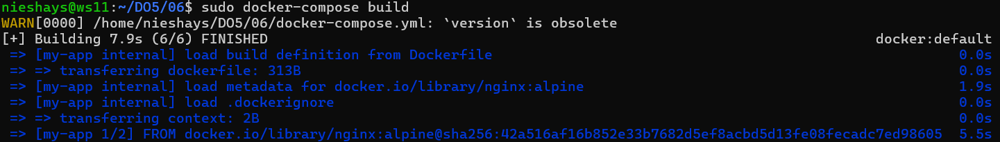

- Запуск образа через команду **sudo docker-compose up -d**

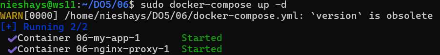

##### Проверь, что в браузере по *localhost:80* отдается написанная тобой страничка, как и ранее.
- В браузере на локальной машине в строке URL пишем **http://localhost:80**
- Вывод страницы:

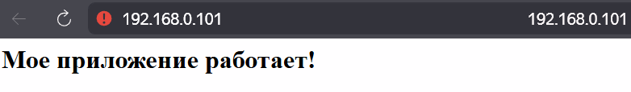