## Part 1. Настройка **gitlab-runner**

`-` Раз ты решил заняться CI/CD, должно быть, ты очень-очень любишь тестировать. Я тоже это люблю. Так что приступим. Если тебе потребуется какая-либо информация, рекомендую искать ответы в официальной документации.

**== Задание ==**

##### Подними виртуальную машину *Ubuntu Server 22.04 LTS*.
*Будь готов, что в конце проекта нужно будет сохранить дамп образа виртуальной машины.*
- У меня виртуальная машина на ubuntu 20.04 LTS, чтобы не создавать новую с нуля можно обновить свою текущую до версии 22.04 LTS
```
Обновить текущую систему:
sudo apt update && sudo apt upgrade -y

Создание резервной копии:
sudo tar -czf backup_home.tar.gz ~/

Запуск апгрейда:
sudo do-release-upgrade
```

##### Скачай и установи на виртуальную машину **gitlab-runner**.
- Добавляем официальный репозиторий GitLab **curl -L "https://packages.gitlab.com/install/repositories/runner/gitlab-runner/script.deb.sh" | sudo bash**
(Эта команда скачивает и запускает скрипт, который автоматически добавит в систему источник, откуда можно будет установить актуальную версию **gitlab-runner**)
- Устанавливается gitlab-runner при помощи команды **sudo apt install -y gitlab-runner**
- Чтобы проверить установился ли gitlab-runner, проверим его версию: **sudo gitlab-runner --version**

##### Запусти **gitlab-runner** и зарегистрируй его для использования в текущем проекте (*DO6_CICD*).
- Для регистрации понадобятся URL и токен, которые можно получить на страничке задания на платформе.
- Для проверки работоспособности нужно ввести **sudo gitlab-runner status** (должно быть ***gitlab-runner: Service is running***)

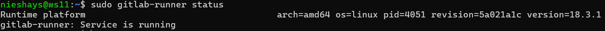

- Для регистрации **gitlab-runner** я использовал URL и токен со страницы своего проекта.
- Использовал я их после ввода команды **sudo gitlab-runner register**
- На начальном этапе я выбрал **shell** исполнителя (Для начала подойдет самый простой исполнитель, который будет запускать все команды пайплайна прямо на виртуальной машине)

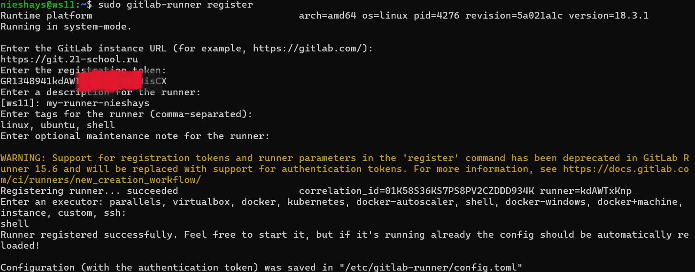

- Сообщение: ```Runner registered successfully```, говорит о том, что регистрация прошла успешно.


## Part 2. Сборка


`-` Предыдущее испытание было создано, чтобы повышать в людях уверенность в себе.
Теперь я подкорректировала тесты, сделав их более сложными и менее льстивыми.


**== Задание ==**

**== Если проект *SimpleBashUtils* не выполнен ==**

#### Напиши этап для **CI** по сборке приложения из папки code-samples *DO*.

#### В файле _.gitlab-ci.yml_ добавь этап запуска сборки через мейк файл из папки code-samples.

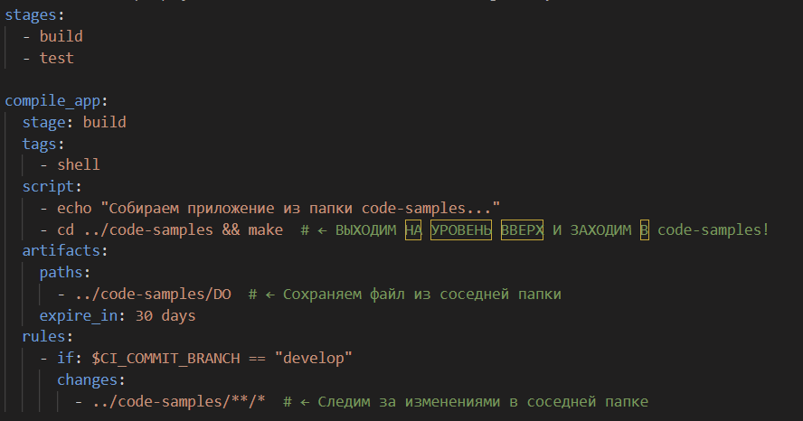

#### Файлы, полученные после сборки (артефакты), сохрани в произвольную директорию со сроком хранения 30 дней.

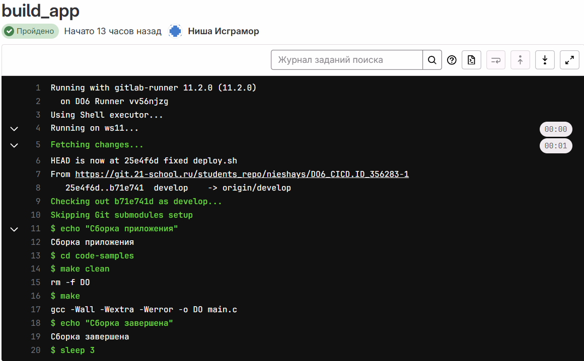


## Part 3. Тест кодстайла

`-` Поздравляю, ты выполнил абсолютно бессмысленную задачу. Шучу. Она была нужна для перехода ко всем последующим.

**== Задание ==**

#### Напиши этап для **CI**, который запускает скрипт кодстайла (*clang-format*).

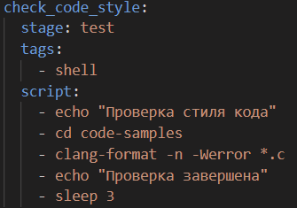

```
ОБЯЗАТЕЛЬНО: Перед тем, как отправить ***.gitlab-ci.yml*** в репозиторий проекта на git нужно его перенести в корень проекта, потому что из папки src gitlab не видит этот файл!!!
Файл clang-format должен находится в той же директории, что и проверяемый файл. То есть в одной папке с файлом main.c
```

##### Если кодстайл не прошел, то «зафейли» пайплайн.

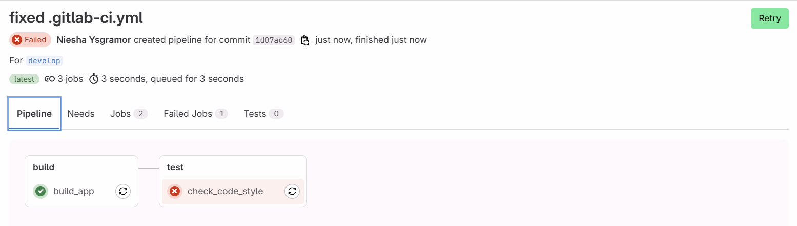

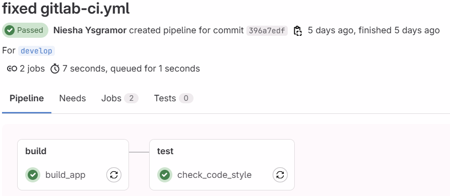

##### В пайплайне отобрази вывод утилиты *clang-format*.
- Можно увидеть вывод утилиты в реальном времени при помощи команды **sudo journalctl -u gitlab-runner -f**
- Также можно увидеть за вчерашний день **sudo journalctl -u gitlab-runner --since "2025-09-18 00:00:00" --until "2025-09-18 23:59:59"**. Достаточно ввести нужное время
- Или посмотреть за последнее время **sudo journalctl -u gitlab-runner --since "5 minutes ago"**

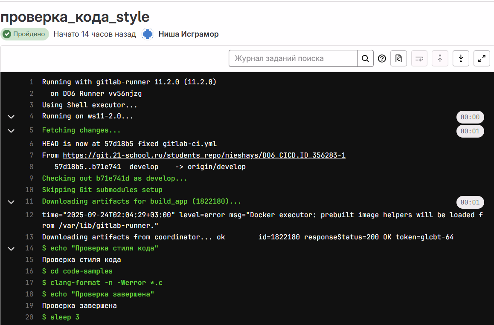


## Part 4. Интеграционные тесты

`-` Отлично, тест на кодстайл написан. [ТИШЕ] Говорю с тобой тет-а-тет. Не говори ничего коллегам. Между нами: ты справляешься очень хорошо. [ГРОМЧЕ] Переходим к написанию интеграционных тестов.

**== Задание ==**

#### Напиши этап для **CI**, который запустит интеграционные тесты.

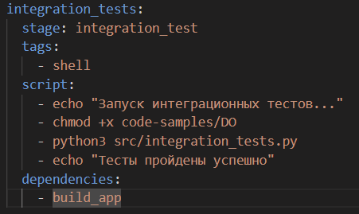

##### Для проекта из папки code-samples напиши интеграционные тесты самостоятельно. Тесты могут быть написаны на любом языке (c, bash, python и т.д.) и должны вызывать собранное приложение для проверки его работоспособности на разных случаях.

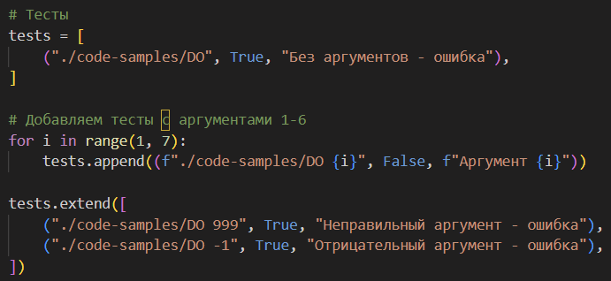

##### Запусти этот этап автоматически только при условии, если сборка и тест кодстайла прошли успешно.
- На виртуальной машине можно проверить работоспособность тестов. Для этого нужно запустить Makefile командой **make**.
- Создастся исполняемый файл.
- Далее выходим в корень нашего проекта (там должны находится интеграционные тесты ***integration_tests.py***)
- Вводим команду ***python3 integration_tests.py***
- Наблюдаем красивый вывод и что все тесты пройдены


##### Если тесты не прошли, то «зафейли» пайплайн.
- Было и такое, что тесты не проходили

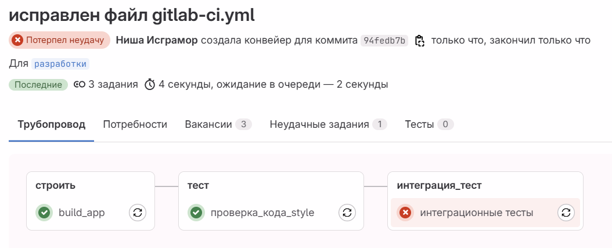

##### В пайплайне отобрази вывод, что интеграционные тесты успешно прошли / провалились.
- На этом скриншоте 2 теста (провальный, а верхний, то есть последний успешный)

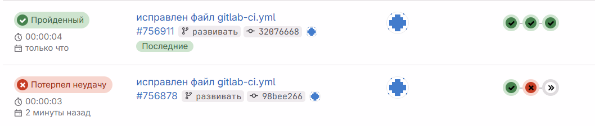

- Вывод, что тесты прошли успешно

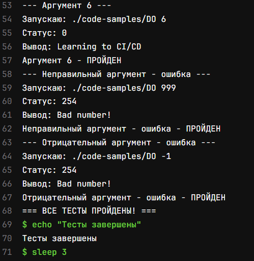


## Part 5. Этап деплоя

`-` Для завершения этого задания ты должен перенести исполняемые файлы на другую виртуальную машину, которая будет играть роль продакшна. Удачи.

**== Задание ==**

##### Подними вторую виртуальную машину *Ubuntu Server 22.04 LTS*.

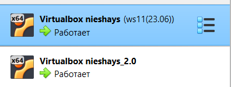

#### Напиши этап для **CD**, который «разворачивает» проект на другой виртуальной машине.
- Этап CD нужен для автоматического развертывания (запуска) программы на другой ВМ.

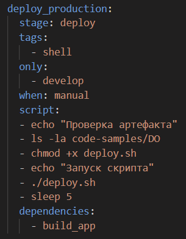

##### Запусти этот этап вручную при условии, что все предыдущие этапы прошли успешно.
- Для запуска этого этапа вручную должен быть прописан во фрагменте кода файла ***gitlab-ci.yml*** строка **when: manual**. Это означает ручной запуск. Без этого параметра деплой будет запускаться автоматически.

##### Напиши bash-скрипт, который при помощи **ssh** и **scp** копирует файлы, полученные после сборки (артефакты), в директорию */usr/local/bin* второй виртуальной машины.
*Тут тебе могут помочь знания, полученные в проекте DO2_LinuxNetwork.*

- Будь готов объяснить по скрипту, как происходит перенос.
- Для выполнения этого пункта мне пришлось сделать доступ к папке по адресу ***/usr/local/bin/*** без запроса пароля и для копировании туда необходимых исполняемых файлов согласно заданию. Если этого не сделать, то копирование туда исполнительного файла будет не возможен. Так как это директория является системной, соответственно туда никакие файлы перенести нельзя и работа деплоя будет всегда заканчиваться ошибкой.
- Для этого я использовал команду **sudo nano /etc/sudoers.d/nieshays**
- Далее добавить содержимое в файл **nieshays ALL=(ALL) NOPASSWD: /bin/mv /tmp/DO /usr/local/bin/DO, /bin/chmod +x /usr/local/bin/DO**
- Эта команда переносит файл DO из временной директории **tpm** в директорию **/usr/local/bin/**
- Другая часть кода дает файлу права на исполнение **chmod +x**
- Обязательно проверить синтаксис **sudo visudo -c**. Должно быть всё ОК.


```
Для проверки, если что-то сломается
scp -o StrictHostKeyChecking=no code-samples/DO nieshays@192.168.0.102:/tmp/
ssh -o StrictHostKeyChecking=no nieshays@192.168.0.102 "sudo mv /tmp/DO /usr/local/bin/ && sudo chmod +x /usr/local/bin/DO"
ssh -o StrictHostKeyChecking=no nieshays@192.168.0.102 "/usr/local/bin/DO 1"
```

##### В файле _.gitlab-ci.yml_ добавь этап запуска написанного скрипта.

##### В случае ошибки «зафейли» пайплайн.

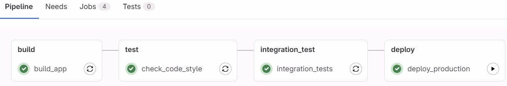

В результате ты должен получить готовое к работе приложения из проекта *SimpleBashUtils* (*cat* и *grep*) или приложение из папки code-samples (*DO*) на второй виртуальной машине (в зависимости от того, что ты выполнял).
- Исполняемый файл в директории **/usr/local/bin/**

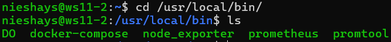

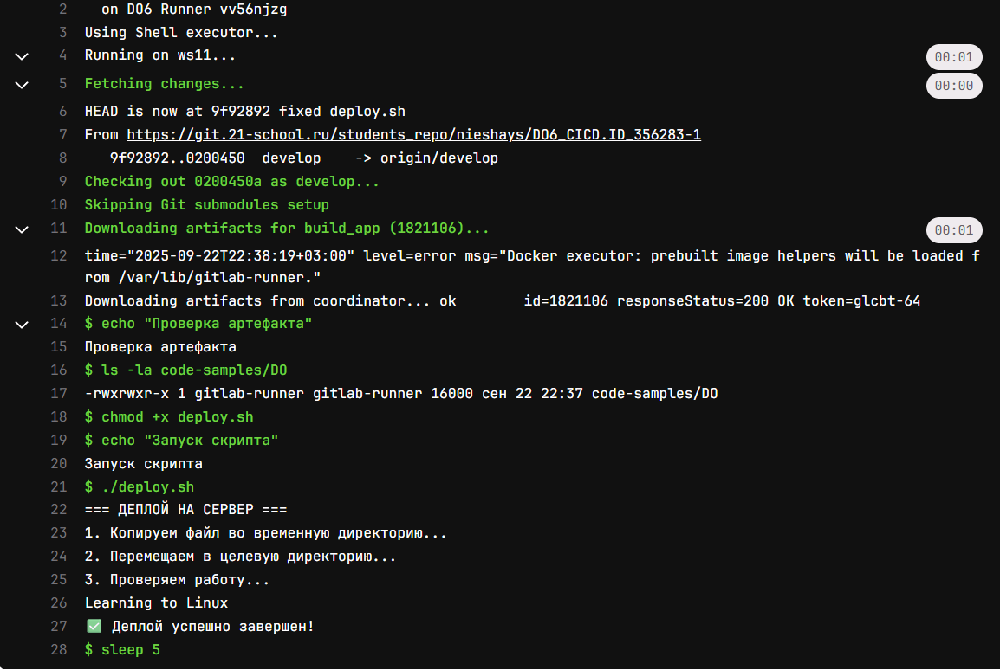

##### Сохрани дампы образов виртуальных машин.

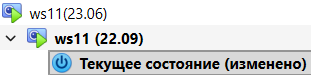

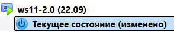

**P.S. Ни в коем случае не сохраняй дампы в гит!**
- Не забудь запустить пайплайн с последним коммитом в репозитории.